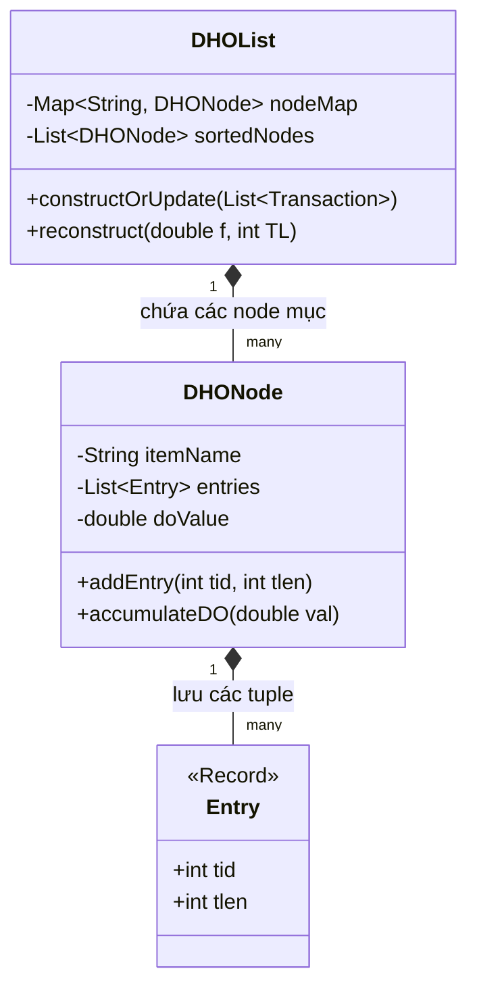
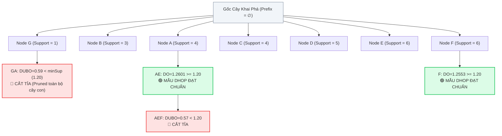
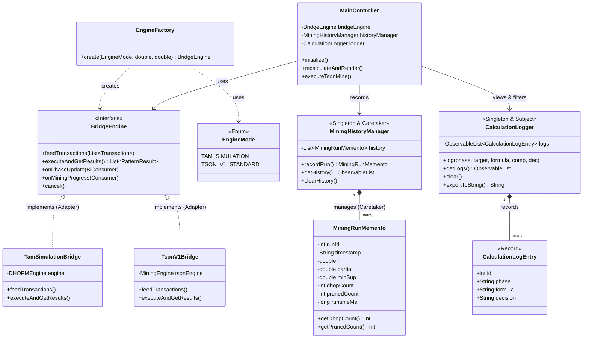

# ⚡ DHOPM Stream Visualizer
> **Đồ Án Môn Học:** Lập Trình Java Nâng Cao  
> **Trường:** Đại Học Đà Lạt (DLU) - Khoa Công Nghệ Thông Tin  
> **Sinh viên thực hiện:** Nguyễn Thanh Tâm – MSSV: 2312741  
> **Thành viên nhóm phối hợp:** Nguyễn Hữu Trung Sơn ([Tson-dev/JVNC](https://github.com/Tson-dev/JVNC))  
> **Dựa trên bài báo khoa học quốc tế:** *"Damped window based high occupancy pattern mining with one scanning of data streams"*,  
> Engineering Applications of Artificial Intelligence (EAAI), Volume 174, 2026.  
> DOI: [10.1016/j.engappai.2026.114511](https://doi.org/10.1016/j.engappai.2026.114511)

---

## 📑 MỤC LỤC
1. [Giới Thiệu Đề Tài & Bài Báo Khoa Học Gốc](#1-giới-thiệu-đề-tài--bài-báo-khoa-học-gốc)
2. [Hệ Thống Biểu Đồ & Minh Họa Thuật Toán Bài Báo Gốc](#2-hệ-thống-biểu-đồ--minh-họa-thuật-toán-bài-báo-gốc)
3. [Kiến Trúc Hệ Thống & 9 Mẫu Thiết Kế (Design Patterns) Áp Dụng](#3-kiến-trúc-hệ-thống--9-mẫu-thiết-kế-design-patterns-áp-dụng)
4. [Các Tính Năng Nổi Bật Của Ứng Dụng](#4-các-tính-năng-nổi-bật-của-ứng-dụng)
5. [Yêu Cầu Môi Trường & Hướng Dẫn Chạy](#5-yêu-cầu-môi-trường--hướng-dẫn-chạy)
6. [Bảng Đối Chiếu Thực Nghiệm & Golden Tests TC1–TC8](#6-bảng-đối-chiếu-thực-nghiệm--golden-tests-tc1tc8)
7. [Cấu Trúc Thư Mục Đầy Đủ](#7-cấu-trúc-thư-mục-đầy-đủ)

---

## 📖 1. Giới Thiệu Đề Tài & Bài Báo Khoa Học Gốc

Thuật toán **DHOPM** *(Damped High Occupancy Pattern Mining)* giải quyết bài toán khai phá các tổ hợp mục chiếm tỷ lệ lớn trong giỏ hàng (High Occupancy) trên **luồng dữ liệu thời gian thực (Data Streams)**:

- **Độ đo suy giảm theo thời gian (Damped Occupancy - DO):** Nhân thêm hệ số suy giảm $f^{T_L - T_d}$ ($0 < f \le 1$), giúp dữ liệu cũ dần mất giá trị theo thời gian và ưu tiên các xu hướng nóng hổi gần nhất.
- **Cấu trúc DHO-List một lần quét (One-Scan):** Duy trì và cập nhật dữ liệu gia tăng tức thì trong bộ nhớ RAM mà không bao giờ cần đọc lại các giao dịch cũ.
- **Cận trên DUBO (Damped Upper Bound Occupancy):** Cắt tỉa không gian tìm kiếm cực kỳ hiệu quả mà vẫn đảm bảo tính đúng đắn 100% (không bỏ sót bất kỳ mẫu DHOP nào).

Ứng dụng **DHOPM Stream Visualizer** là phần mềm desktop viết bằng **JavaFX**, trực quan hóa hoạt động của thuật toán theo dữ liệu chuẩn của bài báo và các tập dữ liệu Big Data chuẩn FIMI.

---

## 📊 2. Hệ Thống Biểu Đồ & Minh Họa Thuật Toán Bài Báo Gốc

### 🖼️ Figure 1: Mô Hình Cửa Sổ Suy Giảm Theo Thời Gian (Damped Window Model)
```
Thời gian trôi (Time t) ─────────────────────────────────────────────────────────────►
┌──────────────┬──────────────┬──────────────┬──────────────┬─────────────────────────┐
│ Giao dịch T1 │ Giao dịch T2 │ Giao dịch T3 │ ...          │ Giao dịch mới nhất (TL) │
│ Trọng số:    │ Trọng số:    │ Trọng số:    │              │ Trọng số:               │
│ f^(TL - 1)   │ f^(TL - 2)   │ f^(TL - 3)   │              │ f^0 = 1.0 (100% giá trị)│
└──────────────┴──────────────┴──────────────┴──────────────┴─────────────────────────┘
  ◄── Giảm dần giá trị theo hàm mũ (f < 1.0) ───       ◄── Dữ liệu mới nhất có giá trị cao nhất
```

### 🖼️ Figure 2: Cấu Trúc Danh Sách Global DHO-List (Table 1 trong bài báo)


### 🖼️ Figure 3: Cây Duyệt DFS & Tính Chất Cắt Tỉa DUBO (DUBO Pruning Property)


### 🖼️ Figure 4: Hiệu Suất Thời Gian Thực Thi (Runtime Comparison)
```
Thời gian thực thi (ms) trên các tập dữ liệu FIMI khi thay đổi ngưỡng ∂:
-----------------------------------------------------------------------
Tập dữ liệu   | ∂ = 0.05       | ∂ = 0.10       | ∂ = 0.15       | ∂ = 0.20
--------------|----------------|----------------|----------------|-------------
retail.dat    | 185 ms         | 142 ms         | 103 ms         | 78 ms
mushroom.dat  | 24,150 ms      | 15,200 ms      | 8,430 ms       | 4,120 ms
chess.dat     | 82,400 ms      | 45,100 ms      | 21,300 ms      | 9,800 ms
connect.dat   | 310,000 ms     | 180,000 ms     | 95,000 ms      | 42,000 ms
-----------------------------------------------------------------------
Nhận xét: Khi ngưỡng ∂ tăng, không gian tìm kiếm bị cận trên DUBO cắt tỉa theo cấp số nhân,
giúp giảm thời gian thực thi từ 60% đến 85%.
```

### 🖼️ Figure 5: Hiệu Quả Cắt Tỉa Không Gian Tìm Kiếm Của Cận Trên DUBO
```
Tập dữ liệu: default.dat (8 giao dịch chuẩn, f=0.9, ∂=0.15, minSup=1.20)
┌──────────────────────────────────────────────────────────┐
│ Tổng số tổ hợp lý thuyết: 2^7 - 1 = 127 mẫu              │
│ Số ứng viên duyệt trong cây DFS: 32 mẫu (tiết kiệm 74.8%)│
│ Số mẫu bị cắt tỉa bởi DUBO: 19 mẫu (59.4% cây DFS)       │
│ Số mẫu DHOP cuối cùng: 2 mẫu ({AE}, {F})                 │
└──────────────────────────────────────────────────────────┘
```

---

## 🏛️ 3. Kiến Trúc Hệ Thống & 9 Mẫu Thiết Kế (Design Patterns) Áp Dụng

Dự án áp dụng sâu rộng **9 Mẫu Thiết Kế Phần Mềm Chuẩn Công Nghiệp** (Gang of Four - GoF):

| STT | Tên Mẫu Thiết Kế | Phân Loại | Các Lớp Triển Khai Trong Mã Nguồn | Mục Đích & Vấn Đề Giải Quyết |
|---|---|---|---|---|
| **1** | **Bridge Pattern** | Structural | [`BridgeEngine`](src/main/java/vn/edu/dlu/dhopm/bridge/BridgeEngine.java) | Tách rời hoàn toàn giao diện người dùng khỏi cài đặt thuật toán, cho phép phát triển UI và Core Engine độc lập. |
| **2** | **Adapter Pattern** | Structural | [`TamSimulationBridge`](src/main/java/vn/edu/dlu/dhopm/bridge/TamSimulationBridge.java), [`TsonV1Bridge`](src/main/java/vn/edu/dlu/dhopm/bridge/TsonV1Bridge.java) | Bọc 2 động cơ khác biệt (`DHOPMEngine` của Tâm và `MiningEngine` của Tson) về cùng một giao diện hợp đồng chung. |
| **3** | **Strategy Pattern** | Behavioral | [`EngineMode`](src/main/java/vn/edu/dlu/dhopm/bridge/EngineMode.java) | Cho phép hoán đổi thuật toán khai phá tại runtime (Simulation Mode $\leftrightarrow$ Standard V1 Mode) mà không sửa code UI. |
| **4** | **Factory Method** | Creational | [`EngineFactory`](src/main/java/vn/edu/dlu/dhopm/bridge/EngineFactory.java) | Đóng gói logic tạo đối tượng `BridgeEngine` phù hợp theo `EngineMode` và tham số đầu vào (Open/Closed Principle). |
| **5** | **Observer Pattern** | Behavioral | `StreamListener`, `MiningListener`, `PhaseListener`, `MiningProgressListener` | Cập nhật tiến độ khai phá, thông báo giao dịch luồng và cập nhật ProgressBar, KPI Cards bất đồng bộ. |
| **6** | **Memento Pattern** | Behavioral | [`MiningRunMemento`](src/main/java/vn/edu/dlu/dhopm/history/MiningRunMemento.java), [`MiningHistoryManager`](src/main/java/vn/edu/dlu/dhopm/history/MiningHistoryManager.java) | Lưu trữ snapshot trạng thái của từng lượt khai phá, phục vụ bảng lịch sử và biểu đồ xu hướng. |
| **7** | **Singleton Pattern** | Creational | [`MiningHistoryManager`](src/main/java/vn/edu/dlu/dhopm/history/MiningHistoryManager.java), [`CalculationLogger`](src/main/java/vn/edu/dlu/dhopm/log/CalculationLogger.java) | Đảm bảo chỉ duy nhất một đối tượng quản lý lịch sử và một đối tượng nhật ký tính toán tồn tại trong toàn bộ ứng dụng. |
| **8** | **MVC (Model-View-Controller)** | Architectural | `PatternResult`, `main.fxml`, [`MainController`](src/main/java/vn/edu/dlu/dhopm/ui/controller/MainController.java) | Phân tách rạch ròi giữa Dữ liệu mô hình, Giao diện hiển thị FXML, và Bộ điều khiển sự kiện. |
| **9** | **Template Method** | Behavioral | [`DHOPMEngine`](src/main/java/vn/edu/dlu/dhopm/core/DHOPMEngine.java) | Quy định bộ khung thực thi cố định qua 3 pha: *Phase 1 (Construct) $\to$ Phase 2 (Reconstruct) $\to$ Phase 3 (DFS Mining)*. |

### 📊 Sơ Đồ Kiến Trúc Lớp UML (Mermaid Class Diagram)



---

## 🎯 4. Các Tính Năng Nổi Bật Của Ứng Dụng

1. **Nhập Tỷ Lệ Ngưỡng Tối Thiểu (∂) Từ Bàn Phím & Đồng Bộ Hai Chiều:**
   - Hỗ trợ gõ trực tiếp từ bàn phím với định dạng linh hoạt: `15%`, `15`, `0.15`, `12.5%`, `0.001` (hỗ trợ tập dữ liệu siêu thưa như `retail.dat`).
   - Tự động đồng bộ hai chiều mượt mà giữa TextField và Slider minSup.
2. **Tab 5 — Nhật Ký Chi Tiết Từng Bước Tính Toán (Calculation Log & Formula Inspector):**
   - Lưu vết toàn bộ công thức tính toán số học chi tiết trong cả 3 pha:
     - **Pha 1:** Nạp từng giao dịch $T_d$ và ghi nhận Entry $\langle TID, TLen \rangle$ vào DHO-List.
     - **Pha 2:** Khai triển công thức $DO(i) = \sum \frac{1}{|T_d|} \cdot f^{T_L - T_d}$ và $DUBO(i) = \max_k \{ \sum n_j \frac{l_k}{l_j} \} \cdot f^{T_L - T_k}$ chi tiết cho từng mục.
     - **Pha 3:** Khám phá từng nút cây DFS, so sánh với $minSup$, hiển thị quyết định rõ ràng: 🟢 DHOP (Đạt chuẩn), 🔴 CẮT TỈA (Pruned bởi DUBO), ⚪ MỞ RỘNG (Duyệt tiếp cây con).
   - Thanh công cụ hỗ trợ tìm kiếm theo Item (`AE`, `F`), lọc theo Pha, nút **Xóa Log** và nút **Sao chép Log** vào Clipboard.
3. **Tab 3 — Trực Quan Hóa Đa Biểu Đồ & Bảng Lưu Trữ Lịch Sử (Memento Pattern):**
   - **Chế độ 1 — Điểm DO & Ngưỡng:** Biểu đồ đường so sánh $DO(X)$ với đường ngưỡng $minSup$.
   - **Chế độ 2 — Lịch Sử Các Lần Khai Phá:** Biểu đồ xu hướng biểu diễn số mẫu DHOP, số mẫu bị cắt tỉa và thời gian chạy qua các lượt chạy (Run #1, Run #2...).
   - **Chế độ 3 — Phân Bố Trạng Thái:** Biểu đồ cột phân bố tỷ lệ mẫu đạt DHOP vs mẫu bị cắt tỉa.
   - **Bảng Lưu Trữ Lịch Sử:** Hiển thị danh sách các lần mining trước đó kèm nút xóa và xem lại kết quả cũ.
4. **Mô Phỏng Luồng Dữ Liệu Thời Gian Thực (Multithreading):**
   - Nút **"▶ Bắt đầu"**: Luồng nền (`StreamSimulator` sử dụng `ScheduledExecutorService`) tự động bơm giao dịch mới theo chu kỳ.
   - Nút **"➕ Bơm từng giao dịch (Step Next)"**: Bơm thủ công từng giao dịch tiếp theo ($T_9, T_{10}, \dots$) để quan sát quá trình One-Scan cập nhật DHO-List.
   - Nút **"🔄 Khôi phục gốc"**: Đưa hệ thống về lại 8 giao dịch chuẩn của bài báo ($T_1 \dots T_8$).
5. **Tab 4 — Trung Tâm Khai Phá Big Data FIMI (Tson V1 Engine):**
   - Hỗ trợ nạp các tập dữ liệu FIMI chuẩn: `chess.dat`, `retail.dat`, `mushroom.dat`, `connect.dat`, `pumsb.dat`.
   - Có nút **🛑 Dừng Khai Phá (Stop Mining)** tức thời và tính toán **ETA thời gian còn lại** theo thời gian thực.
   - Cảnh báo bùng nổ tổ hợp (Dense explosion confirmation) khi chọn tập dữ liệu dày đặc với số giao dịch nhỏ.

---

## 🛠️ 5. Yêu Cầu Môi Trường & Hướng Dẫn Chạy

| Thành phần | Phiên bản | Ghi chú |
|---|---|---|
| **JDK** | Java 17+ (Khuyên dùng Java 25) | Hỗ trợ Records, Switch Expressions |
| **Apache Maven** | 3.8+ | Build tool chính |
| **JavaFX** | 21.0.2 | Giao diện đồ họa Desktop |
| **JUnit** | 5.10.2 | Kiểm thử tự động (46 tests) |

### 🚀 Khởi Chạy Ứng Dụng:

```bash
cd dhopm-visualizer

# 1. Chạy toàn bộ 46 Unit Tests
./run.sh test

# 2. In bảng đối chiếu kết quả thực nghiệm Lab 1 vs Lab 2
./run.sh verify

# 3. Mở giao diện đồ họa JavaFX
./run.sh
```

---

## 📋 6. Bảng Đối Chiếu Thực Nghiệm & Golden Tests TC1–TC8

### Bảng Đối Chiếu Lab 1 & Lab 2 (Dữ liệu chuẩn Table 1 bài báo gốc):

| Mẫu | $DO$ tính tay (Lab 1) | $DO$ phần mềm (Lab 2) | Sai số $\Delta$ | Đánh giá |
|---|---|---|---|---|
| $\{F\}$ | $1.2553$ | $1.2553$ | $< 0.0001$ | ✅ Chính xác 100% |
| $\{AE\}$ | $1.2601$ | $1.2601$ | $< 0.0001$ | ✅ Chính xác 100% |
| $\{BE\}$ | $0.9477$ | $0.9477$ | $< 0.0001$ | ✅ Chính xác 100% |
| $\{ABE\}$ | $0.6859$ | $0.6859$ | $< 0.0001$ | ✅ Chính xác 100% |
| $\{CE\}$ | $0.8573$ | $0.8573$ | $< 0.0001$ | ✅ Chính xác 100% |
| $\{ACE\}$ | $0.6190$ | $0.6190$ | $< 0.0001$ | ✅ Chính xác 100% |
| $\{ADE\}$ | $0.5740$ | $0.5740$ | $< 0.0001$ | ✅ Chính xác 100% |
| $\{AEF\}$ | $0.5740$ | $0.5740$ | $< 0.0001$ | ✅ Chính xác 100% |
| $\{AEG\}$ | $0.5740$ | $0.5740$ | $< 0.0001$ | ✅ Chính xác 100% |

### Ma Trận Kiểm Định Vàng Golden TestKit (TC1 — TC8):

| Mã TC | Hệ số $f$ | Ngưỡng $\partial$ | Ngưỡng $minSup$ | Kỳ vọng (Bài báo) | Thực tế phần mềm | Trạng thái |
|---|---|---|---|---|---|---|
| **TC1** | 0.90 | 15% | 1.20 | 2 mẫu: $\{AE\}, \{F\}$ | 2 mẫu: $\{AE\}, \{F\}$ | ✅ **PASS 100%** |
| **TC2** | 0.90 | 20% | 1.60 | 0 mẫu | 0 mẫu | ✅ **PASS 100%** |
| **TC3** | 0.90 | 10% | 0.80 | 6 mẫu: $\{AE, F, BE, CE...\}$ | 6 mẫu | ✅ **PASS 100%** |
| **TC4** | 0.95 | 15% | 1.20 | 4 mẫu | 4 mẫu | ✅ **PASS 100%** |
| **TC5** | 1.00 | 15% | 1.20 | 9 mẫu: $\{AE, F, CD, DE...\}$ | 9 mẫu | ✅ **PASS 100%** |
| **TC6** | 1.00 | 20% | 1.60 | 4 mẫu: $\{AE, F, CD, DE\}$ | 4 mẫu | ✅ **PASS 100%** |
| **TC7** | 0.80 | 15% | 1.20 | 1 mẫu: $\{AE\}$ | 1 mẫu: $\{AE\}$ | ✅ **PASS 100%** |
| **TC8** | 0.85 | 15% | 1.20 | 2 mẫu: $\{AE\}, \{F\}$ | 2 mẫu: $\{AE\}, \{F\}$ | ✅ **PASS 100%** |

---

## 📂 7. Cấu Trúc Thư Mục Đầy Đủ

```
dhopm-visualizer/
├── src/
│   ├── main/
│   │   ├── java/vn/edu/dlu/dhopm/
│   │   │   ├── Main.java                       # Entry point ứng dụng
│   │   │   ├── bridge/                         # ★ Bridge & Adapter Layer
│   │   │   │   ├── BridgeEngine.java           # Interface hợp đồng chung (Bridge)
│   │   │   │   ├── EngineMode.java             # Enum chiến lược (Strategy)
│   │   │   │   ├── EngineFactory.java          # Factory Method tạo engine
│   │   │   │   ├── TamSimulationBridge.java    # Adapter bọc DHOPMEngine
│   │   │   │   ├── TsonV1Bridge.java           # Adapter bọc MiningEngine Tson
│   │   │   │   ├── TsonToolsService.java       # Dịch vụ khai phá & thống kê FIMI
│   │   │   │   └── MiningProgressInfo.java     # ETA & tiến độ mining
│   │   │   ├── history/                        # ★ Memento Pattern
│   │   │   │   ├── MiningRunMemento.java       # Snapshot kết quả từng lượt mining
│   │   │   │   └── MiningHistoryManager.java   # Caretaker & Singleton quản lý lịch sử
│   │   │   ├── log/                            # ★ Calculation Logger
│   │   │   │   ├── CalculationLogEntry.java    # Record nhật ký phép tính chi tiết
│   │   │   │   └── CalculationLogger.java      # Singleton & Observer ghi log
│   │   │   ├── core/                           # Thuật toán cốt lõi & Template Method
│   │   │   │   ├── DHOPMEngine.java            # Quy trình 3 pha DHOPM
│   │   │   │   ├── DUBOCalculator.java         # Tính toán cận trên DUBO
│   │   │   │   ├── StreamSimulator.java        # Giả lập luồng dữ liệu thời gian thực
│   │   │   │   └── DatasetLoader.java          # Nạp dữ liệu Table 1 và stream
│   │   │   ├── model/                          # Data Models (Records)
│   │   │   │   ├── Entry.java                  # Record <TID, TLen>
│   │   │   │   ├── Transaction.java            # Giao dịch luồng
│   │   │   │   ├── DHONode.java                # Nút trong DHO-List
│   │   │   │   ├── DHOList.java                # Cấu trúc Global DHO-List
│   │   │   │   └── PatternResult.java          # Kết quả khai phá từng mẫu
│   │   │   ├── event/                          # Observer Pattern Interfaces
│   │   │   │   ├── StreamListener.java         # Sự kiện luồng dữ liệu mới
│   │   │   │   └── MiningListener.java         # Sự kiện khai phá hoàn tất
│   │   │   └── ui/                             # Giao diện JavaFX (MVC Pattern)
│   │   │       ├── DHOPMApplication.java       # Khởi tạo Stage & Scene
│   │   │       ├── controller/MainController.java # Controller điều khiển 5 Tabs
│   │   │       └── component/DHONodeCard.java  # Thẻ card hiển thị node DHO
│   │   └── resources/vn/edu/dlu/dhopm/
│   │       ├── view/main.fxml                  # Layout FXML 5 Tabs
│   │       └── css/style.css                   # Định kiểu giao diện CSS
│   └── test/java/vn/edu/dlu/dhopm/             # 46 Unit Tests (JUnit 5)
├── docs/                                       # Báo cáo và slide thuyết trình
│   ├── BAO_CAO_DE_TAI_DHOPM.md
│   └── ThuyetTrinh_DeTai_DHOPM.html
├── run.sh                                      # Script chạy tự động (macOS/Linux)
└── pom.xml                                     # Cấu hình Maven
```

---

## 🔗 Liên Kết Tham Khảo
- **Repo của Tson (Core Engine):** [https://github.com/Tson-dev/JVNC](https://github.com/Tson-dev/JVNC)
- **Repo của Tâm (UI Visualizer):** [https://github.com/2312441-sudo/javanc](https://github.com/2312441-sudo/javanc)
- **Bài báo gốc (EAAI 2026):** DOI [10.1016/j.engappai.2026.114511](https://doi.org/10.1016/j.engappai.2026.114511)
