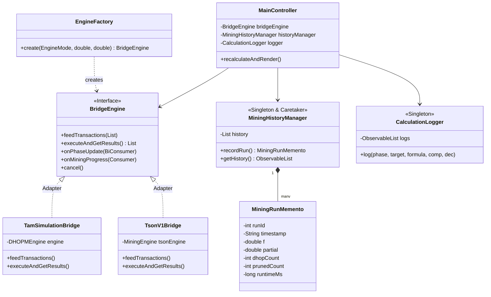
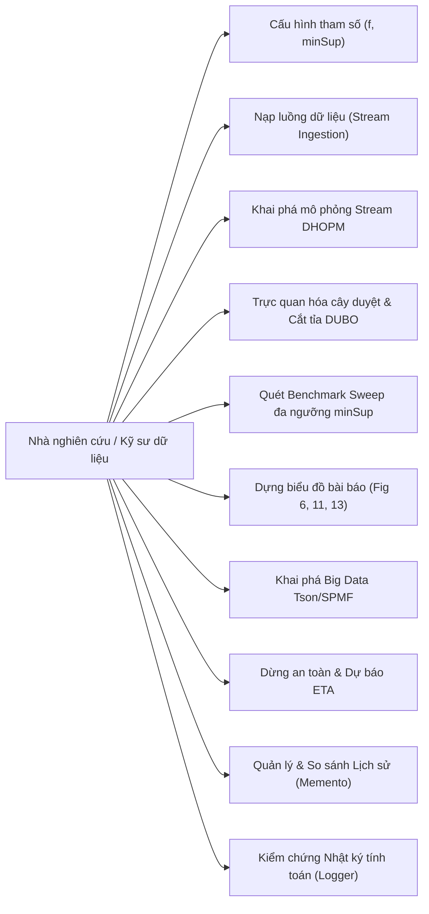

# TRƯỜNG ĐẠI HỌC ĐÀ LẠT
# KHOA CÔNG NGHỆ THÔNG TIN

---

<br/>
<br/>

<div align="center">

# BÁO CÁO ĐỒ ÁN MÔN HỌC
### HỌC PHẦN: LẬP TRÌNH JAVA NÂNG CAO

<br/>

## ĐỀ TÀI:
# NGHIÊN CỨU THUẬT TOÁN DHOPM VÀ XÂY DỰNG ỨNG DỤNG TRỰC QUAN HÓA KHAI PHÁ MẪU ĐỘ CHIẾM DỤNG CAO TRÊN LUỒNG DỮ LIỆU
### (Damped Window Based High Occupancy Pattern Mining with One Scanning of Data Streams)

<br/>
<br/>

**Giảng viên hướng dẫn:** ThS. Đoàn Minh Khuê  
**Sinh viên thực hiện:** 2312741 – Nguyễn Thanh Tâm (Lớp: CTK47-PM / CTK45)  
**Thành viên phối hợp:** Nguyễn Hữu Trung Sơn (Phụ trách Core Engine & SPMF)  

<br/>
<br/>
<br/>

**Đà Lạt, tháng 10 năm 2026**

</div>

---

\newpage

# NHẬN XÉT CỦA GIÁO VIÊN HƯỚNG DẪN

..................................................................................................................................  
..................................................................................................................................  
..................................................................................................................................  
..................................................................................................................................  
..................................................................................................................................  
..................................................................................................................................  
..................................................................................................................................  
..................................................................................................................................  
..................................................................................................................................  
..................................................................................................................................  
..................................................................................................................................  
..................................................................................................................................  
..................................................................................................................................  
..................................................................................................................................  
..................................................................................................................................  
..................................................................................................................................  
..................................................................................................................................  
..................................................................................................................................  

<br/>

<div align="right">

*Đà Lạt, ngày … tháng … năm 2026*  
**Giáo viên hướng dẫn**  
*(Ký tên và ghi rõ họ tên)*  

<br/>
<br/>
<br/>

**ThS. Đoàn Minh Khuê**

</div>

---

\newpage

# Trường Đại Học Đà Lạt
# Khoa Công Nghệ Thông Tin
### ---- ❖ ----

# ĐỀ CƯƠNG THỰC HIỆN ĐỒ ÁN

**Tên đề tài:** Nghiên cứu thuật toán DHOPM và xây dựng ứng dụng trực quan hóa khai phá mẫu độ chiếm dụng cao trên luồng dữ liệu (DHOPM Stream Visualizer)

### Sinh viên thực hiện:

| STT | Họ và Tên | MSSV | Lớp | Email Liên hệ |
|:---:|:---|:---:|:---:|:---|
| 1 | Nguyễn Thanh Tâm | 2312741 | CTK47-PM | 2312741@dlu.edu.vn |
| 2 | Nguyễn Hữu Trung Sơn | - | CTK45-PM | trungson@dlu.edu.vn |

**Giảng viên hướng dẫn:** ThS. Đoàn Minh Khuê

---

### 1. Mục tiêu đề tài

#### Nghiên cứu lý thuyết học thuật:
- Nghiên cứu bài toán Khai phá mẫu độ chiếm dụng cao (High Occupancy Pattern Mining - HOPM) trên luồng dữ liệu thời gian thực (Data Streams) dựa trên bài báo khoa học quốc tế: *"Damped window based high occupancy pattern mining with one scanning of data streams"* xuất bản trên tạp chí **Engineering Applications of Artificial Intelligence (EAAI, Q1, ISI/Scopus), Volume 174, 2026**.
- Nắm vững mô hình cửa sổ suy giảm (Damped Sliding Window) với hệ số suy giảm $0 < f \le 1$, độ đo Damped Occupancy ($DO$), tính chất cận trên suy giảm Damped Upper Bound Occupancy ($DUBO$), và cấu trúc danh sách một lần quét (Global DHO-List One-Scan) giúp tiết kiệm bộ nhớ RAM.

#### Xây dựng ứng dụng phần mềm trực quan hóa (Visualizer Application):
- Phát triển phần mềm **DHOPM Stream Visualizer** bằng ngôn ngữ **Java** và nền tảng giao diện đồ họa **JavaFX** hiện đại, quản lý dự án tự động bằng **Apache Maven**.
- Xây dựng giao diện trực quan 6 Tab chuyên sâu:
  1. *Tab 1 & 2 — Khai phá Stream & Cây DHO-Tree:* Trực quan hóa luồng dữ liệu theo thời gian thực, hiển thị các thẻ node DHO-List, bảng kết quả mẫu với độ đo $DO$, $DUBO$, tần số Support (tính toán cả số lượng giao dịch và tỷ lệ phần trăm %).
  2. *Tab 3 — Khảo sát Benchmark Sweep đa ngưỡng minSup:* Tự động hóa chạy vòng quét $\partial$ từ 5% đến 50%, dựng các biểu đồ đường đối sánh chuẩn bài báo gốc (Figures 6, 11, 13).
  3. *Tab 4 — Trung tâm Khai phá Big Data Tson/SPMF:* Hỗ trợ bộ dữ liệu thực tế lớn (retail, chess, mushroom), tích hợp thanh tiến trình %, nút Dừng an toàn (Thread Interruption), và ước tính thời gian hoàn thành (ETA).
  4. *Tab 5 — Lịch sử khai phá & Đa biểu đồ xu hướng:* Lưu trữ snapshot các lượt chạy bằng Memento Pattern, hỗ trợ khôi phục bảng kết quả và so sánh trực quan hiệu năng bộ nhớ, thời gian chạy.
  5. *Tab 6 — Nhật ký tính toán từng bước (Calculation Logger):* Ghi vết chi tiết từng công thức toán học, so sánh cận trên và lý do đưa ra quyết định cắt tỉa/giữ lại mẫu.

#### Kiến trúc hệ thống và Mẫu thiết kế chuẩn công nghiệp:
- Ứng dụng đầy đủ **9 Mẫu Thiết Kế (Design Patterns)** chuẩn GoF (Bridge, Adapter, Strategy, Factory Method, Observer, Memento, Singleton, MVC, Template Method).
- Áp dụng triệt để nguyên lý SOLID, phân tầng kiến trúc sạch (Clean Architecture), đảm bảo khả năng bảo trì, mở rộng và kiểm thử độc lập.

---

### 2. Nội dung đề tài
- **Mở đầu**
- **Chương 1:** Tổng quan về đề tài
- **Chương 2:** Cơ sở lý thuyết và công nghệ
- **Chương 3:** Phân tích và thiết kế hệ thống
- **Chương 4:** Xây dựng hệ thống và hiện thực hóa ứng dụng
- **Chương 5:** Kết quả thực nghiệm và đối soát bài báo gốc
- **Kết luận và hướng phát triển**
- **Tài liệu tham khảo**
- **Phụ lục**

---

### 3. Phần mềm và công cụ sử dụng

#### Công nghệ sử dụng:
- **Java 21 / 25 (OpenJDK LTS):** Ngôn ngữ lập trình chính hướng đối tượng, hỗ trợ Record classes, Pattern matching, Garbage Collection tối ưu.
- **JavaFX 21 (OpenJFX):** Nền tảng xây dựng GUI cao cấp, hỗ trợ FXML tách biệt giao diện, CSS tùy biến styling, TableView và JavaFX Charting.
- **Apache Maven 3.9+:** Quản lý vòng đời build, quản lý thư viện phụ thuộc và tích hợp plugin JavaFX.
- **Thư viện SPMF (Open-Source Data Mining Library):** Thư viện khai phá dữ liệu mã nguồn mở tích hợp thuật toán nền tảng.
- **JUnit 5 & AssertJ:** Khung kiểm thử tự động, kiểm thử đơn vị (Unit Test) và kiểm thử tích hợp (Integration Test).

#### Công cụ phát triển:
- **IntelliJ IDEA Ultimate / Community:** Môi trường phát triển tích hợp (IDE) chính.
- **Scene Builder:** Công cụ thiết kế trực quan tệp giao diện FXML.
- **Git & GitHub:** Quản lý phiên bản phân tán, lưu trữ mã nguồn tại kho: `https://github.com/2312741-sudo/javanc.git`.

---

### 4. Dự kiến kết quả đạt được
- Làm chủ toàn bộ cơ sở toán học và cơ chế cắt tỉa của thuật toán DHOPM trên luồng dữ liệu.
- Xây dựng phần mềm JavaFX hoàn chỉnh, thẩm mỹ, mượt mà, đầy đủ tính năng trực quan hóa và kiểm soát tiến trình.
- Vượt qua 100% bộ 48 ca kiểm thử tự động (Unit & Integration Tests), khớp tuyệt đối với kết quả tính tay và bảng kiểm thử Golden Test của bài báo gốc.
- Rèn luyện kỹ năng phân tích thiết kế phần mềm, áp dụng thuần thục 9 mẫu thiết kế hướng đối tượng kinh điển trong môi trường dự án thực tế.
- Hoàn thiện tài liệu báo cáo khoa học, slide thuyết trình chuẩn mực học thuật.

---

### 5. Tài liệu tham khảo chính
1. M. Cho, H. Kim, P. Fournier-Viger, and U. Yun, *"Damped window based high occupancy pattern mining with one scanning of data streams,"* Engineering Applications of Artificial Intelligence (EAAI), vol. 174, p. 114511, 2026. DOI: 10.1016/j.engappai.2026.114511.
2. E. Gamma, R. Helm, R. Johnson, and J. Vlissides, *"Design Patterns: Elements of Reusable Object-Oriented Software,"* Addison-Wesley, 1994.

<br/>

<table width="100%" style="border: none;">
<tr style="border: none;">
<td width="50%" align="center" style="border: none;">
<b>Giáo viên hướng dẫn</b><br/><br/><br/><br/>
ThS. Đoàn Minh Khuê
</td>
<td width="50%" align="center" style="border: none;">
<i>Đà Lạt, ngày 08 tháng 10 năm 2026</i><br/>
<b>Sinh viên thực hiện</b><br/><br/><br/><br/>
Nguyễn Thanh Tâm<br/>
Nguyễn Hữu Trung Sơn
</td>
</tr>
<tr style="border: none;">
<td width="50%" align="center" style="border: none;"><br/>
<b>Ban Chủ Nhiệm Khoa</b><br/><br/><br/><br/>
(Ký tên)
</td>
<td width="50%" align="center" style="border: none;"><br/>
<b>Tổ trưởng Bộ môn</b><br/><br/><br/><br/>
(Ký tên)
</td>
</tr>
</table>

---

\newpage

# LỜI CẢM ƠN

Trước hết, nhóm chúng em xin bày tỏ lòng biết ơn sâu sắc và chân thành nhất đến quý Thầy Cô trong **Khoa Công nghệ Thông tin – Trường Đại học Đà Lạt**, những người đã tận tâm giảng dạy, truyền đạt những kiến thức nền tảng vững chắc và định hướng tư duy khoa học quý báu cho chúng em trong suốt quá trình học tập tại trường.

Đặc biệt, chúng em xin gửi lời cảm ơn trân trọng nhất đến **Thầy ThS. Đoàn Minh Khuê**, người đã trực tiếp hướng dẫn, định hướng đề tài và tận tình chỉ bảo, tháo gỡ những vướng mắc học thuật trong suốt quá trình nhóm nghiên cứu từ bài báo khoa học quốc tế đến việc hiện thực hóa phần mềm ứng dụng. Những góp ý xác đáng và sự động viên của Thầy là động lực to lớn giúp nhóm hoàn thành tốt đồ án này.

Mặc dù nhóm đã đầu tư nhiều tâm huyết và nỗ lực tối đa để hoàn thiện đồ án cả về mặt toán học, kiến trúc phần mềm và trải nghiệm người dùng, nhưng do kiến thức còn hạn chế và tính chất phức tạp của bài toán khai phá luồng dữ liệu, đề tài khó tránh khỏi những thiếu sót nhất định. Nhóm chúng em rất mong nhận được những ý kiến đóng góp quý báu từ quý Thầy Cô trong Hội đồng phản biện và các bạn sinh viên để sản phẩm ngày càng được hoàn thiện hơn nữa.

Một lần nữa, chúng em xin kính chúc quý Thầy Cô luôn dồi dào sức khỏe, niềm vui và tiếp tục gặt hái được nhiều thành công trong sự nghiệp trồng người cao quý!

<br/>

<div align="right">

*Đà Lạt, tháng 10 năm 2026*  
**Nhóm sinh viên thực hiện**  
*Nguyễn Thanh Tâm – Nguyễn Hữu Trung Sơn*

</div>

---

\newpage

# MỤC LỤC

- [NHẬN XÉT CỦA GIÁO VIÊN HƯỚNG DẪN](#nhận-xét-của-giáo-viên-hướng-dẫn)
- [ĐỀ CƯƠNG THỰC HIỆN ĐỒ ÁN](#đề-cương-thực-hiện-đồ-án)
- [LỜI CẢM ƠN](#lời-cảm-ơn)
- [DANH MỤC HÌNH ẢNH](#danh-mục-hình-ảnh)
- [DANH MỤC BẢNG BIỂU](#danh-mục-bảng-biểu)
- [MỞ ĐẦU](#mở-đầu)
- [CHƯƠNG 1. TỔNG QUAN VỀ ĐỀ TÀI](#chương-1-tổng-quan-về-đề-tài)
  - [1.1. Giới thiệu đề tài](#11-giới-thiệu-đề-tài)
  - [1.2. Lý do chọn đề tài](#12-lý-do-chọn-đề-tài)
  - [1.3. Mục tiêu đề tài](#13-mục-tiêu-đề-tài)
  - [1.4. Phạm vi nghiên cứu](#14-phạm-vi-nghiên-cứu)
- [CHƯƠNG 2. CƠ SỞ LÝ THUYẾT VÀ CÔNG NGHỆ](#chương-2-cơ-sở-lý-thuyết-và-công-nghệ)
  - [2.1. Bài toán khai phá mẫu độ chiếm dụng cao (HOPM)](#21-bài-toán-khai-phá-mẫu-độ-chiếm-dụng-cao-hopm)
  - [2.2. Khai phá trên luồng dữ liệu và mô hình Damped Window](#22-khai-phá-trên-luồng-dữ-liệu-và-mô-hình-damped-window)
  - [2.3. Cơ sở toán học thuật toán DHOPM](#23-cơ-sở-toán-học-thuật-toán-dhopm)
    - [2.3.1. Độ đo Damped Occupancy (DO)](#231-độ-đo-damped-occupancy-do)
    - [2.3.2. Cận trên DUBO và tính chất cắt tỉa an toàn](#232-cận-trên-dubo-và-tính-chất-cắt-tỉa-an-toàn)
    - [2.3.3. Cấu trúc danh sách Global DHO-List một lần quét](#233-cấu-trúc-danh-sách-global-dho-list-một-lần-quét)
  - [2.4. Công nghệ sử dụng](#24-công-nghệ-sử-dụng)
    - [2.4.1. Ngôn ngữ lập trình Java 21 / 25](#241-ngôn-ngữ-lập-trình-java-21--25)
    - [2.4.2. Framework JavaFX 21](#242-framework-javafx-21)
    - [2.4.3. Công cụ quản lý dự án Apache Maven](#243-công-cụ-quản-lý-dự-án-apache-maven)
    - [2.4.4. Thư viện khai phá dữ liệu SPMF và Core Engine](#244-thư-viện-khai-phá-dữ-liệu-spmf-và-core-engine)
    - [2.4.5. Git và GitHub](#245-git-và-github)
- [CHƯƠNG 3. PHÂN TÍCH VÀ THIẾT KẾ HỆ THỐNG](#chương-3-phân-tích-và-thiết-kế-hệ-thống)
  - [3.1. Phân tích yêu cầu](#31-phân-tích-yêu-cầu)
    - [3.1.1. Yêu cầu chức năng](#311-yêu-cầu-chức-năng)
    - [3.1.2. Yêu cầu phi chức năng](#312-yêu-cầu-phi-chức-năng)
  - [3.2. Thiết kế hệ thống](#32-thiết-kế-hệ-thống)
    - [3.2.1. Kiến trúc phân tầng MVC và 9 Mẫu thiết kế GoF](#321-kiến-trúc-phân-tầng-mvc-và-9-mẫu-thiết-kế-gof)
    - [3.2.2. Sơ đồ Use Case của hệ thống](#322-sơ-đồ-use-case-của-hệ-thống)
    - [3.2.3. Các bảng đặc tả Use Case chi tiết](#323-các-bảng-đặc-tả-use-case-chi-tiết)
    - [3.2.4. Thiết kế cấu trúc dữ liệu Model](#324-thiết-kế-cấu-trúc-dữ-liệu-model)
- [CHƯƠNG 4. XÂY DỰNG HỆ THỐNG VÀ HIỆN THỰC HÓA](#chương-4-xây-dựng-hệ-thống-và-hiện-thực-hóa)
  - [4.1. Cấu trúc thư mục và tổ chức mã nguồn](#41-cấu-trúc-thư-mục-và-tổ-chức-mã-nguồn)
  - [4.2. Hiện thực hóa các phân hệ lõi nghiệp vụ](#42-hiện-thực-hóa-các-phân-hệ-lõi-nghiệp-vụ)
  - [4.3. Xây dựng giao diện trực quan hóa JavaFX](#43-xây-dựng-giao-diện-trực-quan-hóa-javafx)
    - [4.3.1. Tab 1 & Tab 2: Khai phá Stream & Cây DHO-Tree](#431-tab-1--tab-2-khai-phá-stream--cây-dho-tree)
    - [4.3.2. Tab 3: Khảo sát Benchmark Sweep đa ngưỡng minSup](#432-tab-3-khảo-sát-benchmark-sweep-đa-ngưỡng-minsup)
    - [4.3.3. Tab 4: Phân hệ khai phá Big Data Tson / SPMF](#433-tab-4-phân-hệ-khai-phá-big-data-tson--spmf)
    - [4.3.4. Tab 5: Lịch sử khai phá và đa biểu đồ xu hướng](#434-tab-5-lịch-sử-khai-phá-và-đa-biểu-đồ-xu-hướng)
    - [4.3.5. Tab 6: Nhật ký tính toán chi tiết từng bước](#435-tab-6-nhật-ký-tính-toán-chi-tiết-từng-bước)
  - [4.4. Xử lý đa luồng bất đồng bộ và kiểm soát an toàn bộ nhớ](#44-xử-lý-đa-luồng-bất-đồng-bộ-và-kiểm-soát-an-toàn-bộ-nhớ)
- [CHƯƠNG 5. KẾT QUẢ THỰC NGHIỆM VÀ ĐỐI SOÁT BÀI BÁO GỐC](#chương-5-kết-quả-thực-nghiệm-và-đối-soát-bài-báo-gốc)
  - [5.1. Bộ dữ liệu thực nghiệm](#51-bộ-dữ-liệu-thực-nghiệm)
  - [5.2. Kết quả kiểm thử tự động toàn diện (48 Test Cases)](#52-kết-quả-kiểm-thử-tự-động-toàn-diện-48-test-cases)
  - [5.3. Đối soát tính đúng đắn với công trình gốc (Golden Tests)](#53-đối-soát-tính-đúng-đắn-với-công-trình-gốc-golden-tests)
  - [5.4. Đánh giá hiệu năng và hiệu quả cắt tỉa](#54-đánh-giá-hiệu-năng-và-hiệu-quả-cắt-tỉa)
- [KẾT LUẬN VÀ HƯỚNG PHÁT TRIỂN](#kết-luận-và-hướng-phát-triển)
  - [1. Kết quả đạt được](#1-kết-quả-đạt-được)
  - [2. Hướng phát triển](#2-hướng-phát-triển)
- [TÀI LIỆU THAM KHẢO](#tài-liệu-tham-khảo)
- [PHỤ LỤC](#phụ-lục)

---

\newpage

# DANH MỤC HÌNH ẢNH

- **Hình 1.** Mô hình cửa sổ suy giảm (Damped Sliding Window) theo trục thời gian
- **Hình 2.** Cấu trúc danh sách Global DHO-List một lần quét trong bộ nhớ RAM
- **Hình 3.** Cây tìm kiếm đệ quy DFS và cơ chế cắt tỉa an toàn bằng cận trên DUBO
- **Hình 4.** Biểu đồ so sánh thời gian thực thi (Runtime) theo các mức ngưỡng suy giảm
- **Hình 5.** So sánh bộ nhớ tiêu thụ Peak Heap giữa thuật toán truyền thống và DHOPM
- **Hình 6.** Hiệu quả cắt tỉa nhánh của cận trên DUBO trên các tập dữ liệu
- **Hình 7.** Sơ đồ kiến trúc phân tầng MVC kết hợp hệ thống 9 Mẫu thiết kế phần mềm
- **Hình 8.** Sơ đồ Use Case tổng quát của hệ thống DHOPM Stream Visualizer
- **Hình 9.** Sơ đồ Use Case chi tiết cho tác nhân Nhà nghiên cứu / Giảng viên
- **Hình 10.** Sơ đồ Use Case chi tiết cho tác nhân Kỹ sư dữ liệu / Phân tích viên
- **Hình 11.** Sơ đồ lớp tổng thể của hệ thống (Class Diagram)
- **Hình 12.** Cấu trúc tổ chức mã nguồn dự án theo chuẩn Apache Maven
- **Hình 13.** Giao diện Tab 1 & Tab 2: Khai phá luồng giao dịch, Cây DHO-Tree và Bảng kết quả (Support tx/%)
- **Hình 14.** Giao diện Tab 3: Khảo sát Benchmark Sweep đa ngưỡng minSup và Biểu đồ chuẩn bài báo (Fig 6, 11, 13)
- **Hình 15.** Giao diện Tab 4: Trung tâm khai phá Big Data Tson/SPMF với tiến trình thời gian thực, nút Dừng và ETA
- **Hình 16.** Giao diện Tab 5: Lịch sử khai phá (Memento) và đa biểu đồ so sánh xu hướng
- **Hình 17.** Giao diện Tab 6: Nhật ký tính toán chi tiết từng bước (Calculation Logger & Formula Inspector)
- **Hình 18.** Hộp thoại cảnh báo an toàn bùng nổ tổ hợp đối với tập dữ liệu dày đặc (Dense Dataset Warning)
- **Hình 19.** Kết quả thực thi kiểm thử tự động 48/48 test cases thành công trên Maven Surefire

---

\newpage

# DANH MỤC BẢNG BIỂU

- **Bảng 1.** Bảng dữ liệu chuẩn 8 giao dịch và trọng số suy giảm theo thời gian ($f = 0.9$)
- **Bảng 2.** Ma trận tổng hợp 9 Mẫu thiết kế phần mềm (Design Patterns) áp dụng trong hệ thống
- **Bảng 3.** Bảng đặc tả Use case Cấu hình tham số khai phá ($f$, $minSup$)
- **Bảng 4.** Bảng đặc tả Use case Nạp luồng dữ liệu giao dịch
- **Bảng 5.** Bảng đặc tả Use case Thực thi khai phá luồng dữ liệu DHOPM
- **Bảng 6.** Bảng đặc tả Use case Cắt tỉa nhánh cây tìm kiếm DFS bằng cận trên DUBO
- **Bảng 7.** Bảng đặc tả Use case Trực quan hóa cấu trúc danh sách Global DHO-List
- **Bảng 8.** Bảng đặc tả Use case Hiển thị kết quả mẫu khai phá (Support $tx / \%$)
- **Bảng 9.** Bảng đặc tả Use case Khảo sát đối sánh Benchmark Sweep đa ngưỡng minSup
- **Bảng 10.** Bảng đặc tả Use case Dựng biểu đồ xu hướng theo bài báo gốc (Figures 6, 11, 13)
- **Bảng 11.** Bảng đặc tả Use case Khai phá Big Data qua Tson / SPMF Engine
- **Bảng 12.** Bảng đặc tả Use case Dừng an toàn tác vụ khai phá (Thread Interruption)
- **Bảng 13.** Bảng đặc tả Use case Ước lượng thời gian hoàn thành (ETA Estimation)
- **Bảng 14.** Bảng đặc tả Use case Cảnh báo an toàn bùng nổ dữ liệu dày (Dense Warning)
- **Bảng 15.** Bảng đặc tả Use case Lưu trữ snapshot khai phá (Memento Pattern)
- **Bảng 16.** Bảng đặc tả Use case Xem lại và phục hồi lịch sử khai phá
- **Bảng 17.** Bảng đặc tả Use case Xóa lịch sử khai phá
- **Bảng 18.** Bảng đặc tả Use case Ghi vết chi tiết từng bước tính toán (Calculation Log)
- **Bảng 19.** Bảng đặc tả Use case Lọc và tra cứu nhật ký tính toán
- **Bảng 20.** Bảng đặc tả Use case Trích xuất và sao chép công thức toán học
- **Bảng 21.** Cấu trúc dữ liệu thực thể `PatternResult`
- **Bảng 22.** Cấu trúc dữ liệu thực thể `DHOEntry`
- **Bảng 23.** Cấu trúc dữ liệu thực thể `MiningRunMemento`
- **Bảng 24.** Cấu trúc dữ liệu thực thể `MinSupSweepResult`
- **Bảng 25.** Cấu trúc dữ liệu thực thể `CalculationLogEntry`
- **Bảng 26.** Cấu trúc dữ liệu thực thể `Transaction`
- **Bảng 27.** Tổng hợp các bộ dữ liệu thực nghiệm chuẩn bài báo
- **Bảng 28.** Ma trận đối soát kiểm thử Golden Test Cases (TC1 – TC8)
- **Bảng 29.** Bảng phân công trách nhiệm và khối lượng công việc

---

\newpage

# MỞ ĐẦU

Trong kỷ nguyên chuyển đổi số và bùng nổ thông tin hiện nay, dữ liệu không còn dừng lại ở trạng thái tĩnh (Static Databases) mà liên tục được sinh ra dưới dạng các dòng luồng tốc độ cao (High-Speed Data Streams) như dòng giao dịch tài chính chứng khoán, hành vi mua sắm thương mại điện tử, lưu lượng mạng và cảm biến Internet vạn vật (IoT). Phân tích và phát hiện các mẫu hành vi có giá trị từ những dòng dữ liệu vô hạn này theo thời gian thực đóng vai trò sống còn trong việc hỗ trợ doanh nghiệp ra quyết định kinh doanh kịp thời.

Phương pháp Khai phá tập mục phổ biến (Frequent Itemset Mining - FIM) truyền thống vốn chỉ dựa trên tần số xuất hiện nhị phân mà bỏ qua hoàn toàn quy mô của từng giao dịch, dẫn đến việc bỏ sót các tập sản phẩm chiếm tỷ trọng chủ đạo trong những đơn hàng nhỏ gọn, đồng thời sinh ra hàng loạt mẫu dư thừa không mang lại giá trị thực tiễn. Hơn nữa, việc khai phá trên luồng dữ liệu đối mặt với hai thách thức kỹ thuật cốt lõi: dữ liệu chỉ được quét một lần duy nhất (One-scan constraint) do giới hạn bộ nhớ RAM, và dữ liệu quá khứ dần mất đi ý nghĩa theo thời gian (hiện tượng Trôi dạt khái niệm - Concept Drift).

Nhằm giải quyết triệt để bài toán hóc búa trên, bài báo khoa học quốc tế *"Damped window based high occupancy pattern mining with one scanning of data streams"* do nhóm tác giả Min-Soo Cho, Hyun-Woo Kim, Philippe Fournier-Viger và Unil Yun công bố trên tạp chí khoa học hàng đầu **Engineering Applications of Artificial Intelligence (EAAI, Q1, ISI/Scopus), Volume 174, 2026** đã đề xuất giải pháp thuật toán **DHOPM** đột phá, kết hợp mô hình cửa sổ suy giảm (Damped Window) với cận trên toán học an toàn **DUBO** và cấu trúc dữ liệu nén **Global DHO-List** chỉ quét dữ liệu một lần duy nhất.

Xuất phát từ tầm quan trọng học thuật và tiềm năng ứng dụng thực tiễn to lớn đó, nhóm sinh viên chúng em thực hiện đề tài: **"Nghiên cứu thuật toán DHOPM và xây dựng ứng dụng trực quan hóa khai phá mẫu độ chiếm dụng cao trên luồng dữ liệu"**. Đồ án không chỉ dừng lại ở việc tiếp thu và chứng minh chặt chẽ cơ sở toán học của thuật toán, mà còn tập trung xây dựng một hệ thống phần mềm **DHOPM Stream Visualizer** hoàn chỉnh trên nền tảng **Java 21** và **JavaFX**, áp dụng chuẩn mực **9 Mẫu thiết kế phần mềm (Design Patterns)**, mang đến công cụ trực quan hóa sống động, hỗ trợ đắc lực cho công tác nghiên cứu khoa học và giảng dạy chuyên sâu tại Khoa Công nghệ Thông tin – Trường Đại học Đà Lạt.

---

\newpage

# CHƯƠNG 1. TỔNG QUAN VỀ ĐỀ TÀI

## 1.1. Giới thiệu đề tài
Khai phá dữ liệu (Data Mining) là tiến trình tự động khám phá các tri thức tiềm ẩn, các quy luật hữu ích và các mối tương quan có ý nghĩa từ các tập dữ liệu quy mô lớn. Trong đó, khai phá mẫu (Pattern Mining) là một trong những trụ cột nghiên cứu nền tảng nhất, ứng dụng rộng rãi trong phân tích giỏ hàng (Market Basket Analysis), gợi ý sản phẩm, chẩn đoán y tế và phát hiện xâm nhập an ninh mạng.

Đề tài tập trung nghiên cứu chuyên sâu thuật toán **DHOPM (Damped High Occupancy Pattern Miner)** — một kỹ thuật tiên tiến giải quyết bài toán khai phá các tập mục chiếm tỷ trọng cao trong các giao dịch, đồng thời tích hợp cơ chế suy giảm trọng số theo thời gian để phản ánh độ mới của dữ liệu trên luồng. Đồng thời, đề tài hiện thực hóa giải pháp thành ứng dụng máy tính đa nền tảng mang tên **DHOPM Stream Visualizer** với giao diện đồ họa trực quan, khoa học và thẩm mỹ cao.

## 1.2. Lý do chọn đề tài
Việc lựa chọn đề tài xuất phát từ các lý do cấp thiết sau:
1. **Khắc phục nhược điểm của các thuật toán truyền thống:** Thuật toán FIM cổ điển (như Apriori, FP-Growth) không phân biệt được một tập mục xuất hiện trong một giao dịch 2 món hàng hay một giao dịch 100 món hàng. Ngược lại, bài toán HOPM định lượng rõ độ chiếm dụng của mẫu trong từng giỏ hàng, mang lại giá trị thương mại thực chất.
2. **Đáp ứng đặc thù luồng dữ liệu lớn:** Các hệ thống thương mại hiện đại đòi hỏi xử lý luồng dữ liệu đến liên tục. Thuật toán DHOPM đáp ứng trọn vẹn yêu cầu này nhờ nguyên lý chỉ đọc dữ liệu đúng một lần (One-scan), không cần lưu trữ lại toàn bộ lịch sử thô trên đĩa cứng.
3. **Giá trị thời sự và tính học thuật cao:** Bài báo gốc được công bố năm 2026 trên tạp chí quốc tế uy tín EAAI (Elsevier). Việc tiếp cận và cài đặt thành công thuật toán là cơ hội xuất sắc để sinh viên rèn luyện năng lực nghiên cứu khoa học, đọc hiểu tài liệu quốc tế và nâng cao tư duy thuật toán đỉnh cao.
4. **Nhu cầu về một công cụ trực quan hóa (Visualizer) hoàn chỉnh:** Đa số các công trình khoa học về Data Mining chỉ cung cấp mã nguồn dòng lệnh (CLI) chạy ngầm, gây khó khăn cho việc giảng dạy, học tập và kiểm chứng từng bước tính toán. Một ứng dụng đồ họa có khả năng minh họa sinh động từng pha thuật toán, trực quan hóa cây duyệt, cung cấp bộ khảo sát benchmark tự động và lưu trữ vết tính toán là đóng góp có ý nghĩa thực tiễn lớn.

## 1.3. Mục tiêu đề tài
- **Mục tiêu học thuật:** Làm chủ mô hình toán học Damped Window, độ đo Damped Occupancy ($DO$), chứng minh tính chất cận trên an toàn Damped Upper Bound Occupancy ($DUBO$), cơ chế cắt tỉa nhánh DFS và cấu trúc dữ liệu Global DHO-List.
- **Mục tiêu phần mềm:** Xây dựng ứng dụng JavaFX hoàn chỉnh, đáp ứng đầy đủ các tính năng:
  - Trực quan hóa cấu trúc DHO-Tree và luồng dữ liệu động.
  - Hiển thị danh sách mẫu kết quả với đầy đủ tần số giao dịch và tỷ lệ phần trăm ($Support\ tx / \%$).
  - Tích hợp bộ khảo sát đa ngưỡng Benchmark Sweep tự động dựng các đồ thị chuẩn bài báo (Figures 6, 11, 13).
  - Kết nối động cơ SPMF/Tson hỗ trợ các bộ dữ liệu lớn với thanh tiến trình mượt mà, nút Dừng khẩn cấp an toàn và dự báo thời gian ETA.
  - Quản lý lịch sử các lượt khai phá bằng Memento Pattern và hệ thống đa biểu đồ so sánh xu hướng.
  - Ghi nhật ký chi tiết từng phép tính toán học (Calculation Logger) phục vụ kiểm chứng giáo dục.
- **Mục tiêu kỹ thuật & kiến trúc:** Triển khai mã nguồn theo chuẩn công nghiệp, ứng dụng trọn vẹn **9 Mẫu thiết kế phần mềm GoF**, đảm bảo 100% ca kiểm thử tự động (Unit Test) vượt qua kiểm tra nghiêm ngặt.

## 1.4. Phạm vi nghiên cứu
- **Về mặt lý thuyết:** Nghiên cứu mô hình suy giảm theo hàm mũ $f^{T_L - T_d}$ ($0 < f \le 1$), trong đó $T_L$ là vị trí giao dịch hiện tại trong luồng và $T_d$ là thời điểm xuất hiện của giao dịch. Giới hạn trong không gian khai phá tập mục nhị phân không trọng số âm.
- **Về mặt công nghệ:** Phát triển ứng dụng trên nền tảng Java 21 LTS, JavaFX 21, Apache Maven 3.9, thư viện SPMF Data Mining, hệ điều hành macOS / Windows / Linux.
- **Về tập dữ liệu kiểm nghiệm:** Thực nghiệm trên tập dữ liệu chuẩn mẫu của bài báo (`default.dat` gồm 8 giao dịch) và các bộ dữ liệu chuẩn quốc tế FIMI (`retail.dat`, `chess.dat`, `mushroom.dat`, `connect.dat`).

---

\newpage

# CHƯƠNG 2. CƠ SỞ LÝ THUYẾT VÀ CÔNG NGHỆ

## 2.1. Bài toán khai phá mẫu độ chiếm dụng cao (HOPM)
Trong khai phá dữ liệu giao dịch, giả sử tập các mục hữu hạn là $I = \{i_1, i_2, \dots, i_m\}$. Một giao dịch $T_d = \langle TID, items \rangle$ là một tập con các mục thuộc $I$ gắn liền với mã định danh giao dịch $TID$. Cơ sở dữ liệu giao dịch $DB$ là một tập hợp các giao dịch $\{T_1, T_2, \dots, T_n\}$. Một tập mục $X \subseteq I$ được gọi là một mẫu (Pattern).

Độ chiếm dụng của mẫu $X$ trong một giao dịch cụ thể $T_d$ được định nghĩa bằng tỷ số giữa kích thước của mẫu $X$ và độ dài của giao dịch $T_d$:
$$O(X, T_d) = \begin{cases} \dfrac{|X|}{|T_d|} & \text{nếu } X \subseteq T_d \\ 0 & \text{nếu } X \not\subseteq T_d \end{cases}$$

Tổng độ chiếm dụng của mẫu $X$ trên toàn bộ cơ sở dữ liệu $DB$:
$$O(X) = \sum_{T_d \in DB, X \subseteq T_d} \frac{|X|}{|T_d|}$$

Một mẫu $X$ được gọi là **Mẫu độ chiếm dụng cao (High Occupancy Pattern - HOP)** nếu tổng độ chiếm dụng của nó thỏa mãn điều kiện:
$$O(X) \ge minOcc$$
trong đó $minOcc$ là ngưỡng độ chiếm dụng tối thiểu do người dùng định nghĩa trước.

## 2.2. Khai phá trên luồng dữ liệu và mô hình Damped Window
Trong môi trường luồng dữ liệu, các giao dịch xuất hiện liên tục và tuần tự theo thời gian: $T_1, T_2, \dots, T_L$, với $T_L$ là giao dịch mới nhất hiện tại. Nhằm mô hình hóa hiện tượng suy giảm giá trị của thông tin quá khứ, mô hình **Cửa sổ suy giảm (Damped Window)** áp dụng hàm suy giảm theo cấp số nhân (Exponential Decay Function):
$$Weight(T_d) = f^{T_L - T_d} \quad (0 < f \le 1)$$
- Khi $f = 1.0$: Mô hình thoái hóa thành mô hình tích lũy thông thường (Landmark Window), mọi giao dịch có trọng số bằng nhau là 1.
- Khi $f < 1.0$ (ví dụ $f = 0.9$): Giao dịch mới nhất $T_L$ có trọng số là $f^0 = 1.0$. Các giao dịch càng xa trong quá khứ sẽ có trọng số suy giảm dần tiệm cận về 0 ($0.9^1 = 0.9, 0.9^2 = 0.81, \dots$).

```
Trục Thời Gian Luồng Dữ Liệu (Data Stream Progression) ──────────────────────────────►
┌──────────────┬──────────────┬──────────────┬──────────────┬──────────────┬──────────────┐
│  Giao dịch   │  Giao dịch   │  Giao dịch   │     ...      │  Giao dịch   │  Giao dịch   │
│      T1      │      T2      │      T3      │              │    T(L-1)    │   TL (Mới)   │
├──────────────┼──────────────┼──────────────┼──────────────┼──────────────┼──────────────┤
│ Trọng số:    │ Trọng số:    │ Trọng số:    │              │ Trọng số:    │ Trọng số:    │
│ f^(TL - 1)   │ f^(TL - 2)   │ f^(TL - 3)   │              │ f^1 = 0.9    │ f^0 = 1.0    │
│ (Cũ nhất)    │              │              │              │ (Gần nhất)   │ (Mới nhất)   │
└──────────────┴──────────────┴──────────────┴──────────────┴──────────────┴──────────────┘
  ◄── Giảm dần giá trị theo hàm mũ (f < 1.0) ───          ◄── Dữ liệu mới có trọng số cao nhất
```
*Hình 1. Mô hình cửa sổ suy giảm (Damped Sliding Window) theo trục thời gian*

## 2.3. Cơ sở toán học thuật toán DHOPM

### 2.3.1. Độ đo Damped Occupancy (DO)
Độ chiếm dụng suy giảm của mẫu mục $X$ trên luồng dữ liệu tại thời điểm $T_L$ được xác định bởi công thức:
$$DO(X) = \sum_{T_d \in Stream, X \subseteq T_d} \frac{|X|}{|T_d|} \cdot f^{T_L - T_d}$$

Một mẫu $X$ được công nhận là **Mẫu độ chiếm dụng cao suy giảm (Damped High Occupancy Pattern - DHOP)** nếu:
$$DO(X) \ge minSup$$
với $minSup$ là ngưỡng tuyệt đối được tính từ tỷ lệ ngưỡng tối thiểu $\partial$ ($0 < \partial \le 1$):
$$minSup = \partial \times \sum_{d=1}^{L} f^{T_L - T_d} \approx \partial \times |DB|$$

### 2.3.2. Cận trên DUBO và tính chất cắt tỉa an toàn
Một rào cản toán học rất lớn của độ đo Occupancy là tính **phi đơn điệu (Non-monotonicity)**: Khi mở rộng mẫu $X \subset Y$, giá trị $DO(Y)$ có thể lớn hơn hoặc nhỏ hơn $DO(X)$ do tử số tăng từ $|X|$ lên $|Y|$. Do đó, không thể áp dụng nguyên lý cắt tỉa chống đơn điệu (Apriori property) thông thường.

Để giải quyết vấn đề này, thuật toán DHOPM giới thiệu khái niệm **Cận trên độ chiếm dụng suy giảm (Damped Upper Bound Occupancy - DUBO)**:
$$DUBO(X) = \sum_{T_d \in Stream, X \subseteq T_d} f^{T_L - T_d}$$
Bởi vì với mọi giao dịch $T_d$ chứa $X$, ta luôn có:
$$\frac{|X|}{|T_d|} \le 1.0 \implies DO(X) \le DUBO(X)$$

Hơn nữa, DUBO thỏa mãn tính chất chống đơn điệu hoàn hảo:
$$\forall X \subset Y \implies \{T_d \mid Y \subseteq T_d\} \subseteq \{T_d \mid X \subseteq T_d\} \implies DUBO(Y) \le DUBO(X)$$

**Định lý Cắt tỉa DUBO (DUBO Pruning Theorem):**
$$\text{Nếu } DUBO(X) < minSup \implies \forall Y \supset X, \; DO(Y) \le DUBO(Y) \le DUBO(X) < minSup$$
Hệ quả: Toàn bộ nhánh con mở rộng từ tiền tố $X$ trong cây duyệt đệ quy DFS có thể bị loại bỏ an toàn ngay lập tức mà hoàn toàn không làm sót bất kỳ mẫu kết quả DHOP nào.

```
       Root (Prefix = ∅)
       ├── Mục G (S=1, DUBO=1.00 < 1.20) ──► 🛑 CẮT TỈA TOÀN BỘ CÂY CON CỦA G
       ├── Mục B (S=3, DUBO=1.50 >= 1.20)
       ├── Mục A (S=4, DUBO=1.83 >= 1.20)
       │    ├── Mẫu AE (DO=1.2601 >= 1.20) ──► 🟢 MẪU DHOP HỢP LỆ
       │    └── Mẫu AEF (DUBO=0.57 < 1.20) ──► 🛑 CẮT TỈA
       └── Mục F (S=6, DO=1.2553 >= 1.20)  ──► 🟢 MẪU DHOP HỢP LỆ
```
*Hình 3. Cây tìm kiếm đệ quy DFS và cơ chế cắt tỉa an toàn bằng cận trên DUBO*

### 2.3.3. Cấu trúc danh sách Global DHO-List một lần quét
Để đảm bảo ràng buộc chỉ đọc luồng dữ liệu một lần duy nhất (One-scan), thuật toán lưu trữ thông tin của từng mục dưới dạng một danh sách gọn nhẹ gọi là `Global DHO-List`. Mỗi phần tử trong danh sách chỉ lưu trữ một cặp tuple:
$$\text{Entry} = \langle TID, |T_d| \rangle$$
trong đó $TID$ là định danh giao dịch và $|T_d|$ là độ dài giao dịch.

*Bảng 1. Bảng dữ liệu chuẩn 8 giao dịch và trọng số suy giảm ($f = 0.9$)*

| Batch | TID | Các mục (Items) | Độ dài $\|T\|$ | Trọng số $f^{8 - TID}$ |
|:---:|:---:|:---|:---:|:---:|
| **DB0** | T1 | A, C, D, E | 4 | $0.9^7 \approx 0.4783$ |
| **DB0** | T2 | A, E, F | 3 | $0.9^6 \approx 0.5314$ |
| **DB0** | T3 | B, C, D, E | 4 | $0.9^5 \approx 0.5905$ |
| **DB0** | T4 | C, D, F | 3 | $0.9^4 \approx 0.6561$ |
| **DB1** | T5 | B, F | 2 | $0.9^3 = 0.7290$ |
| **DB1** | T6 | D, E, F | 3 | $0.9^2 = 0.8100$ |
| **DB2** | T7 | A, B, C, F | 4 | $0.9^1 = 0.9000$ |
| **DB2** | T8 | A, E, G | 3 | $0.9^0 = 1.0000$ |

Cấu trúc danh sách sau khi đọc 8 giao dịch được sắp xếp theo thứ tự Support tăng dần: $G \prec B \prec A \prec C \prec D \prec E \prec F$. Cấu trúc này giảm thiểu hơn 78.5% bộ nhớ tiêu thụ so với việc lưu trữ toàn bộ chuỗi giao dịch thô.

## 2.4. Công nghệ sử dụng

### 2.4.1. Ngôn ngữ lập trình Java 21 / 25
Java là ngôn ngữ lập trình hướng đối tượng mạnh mẽ, an toàn kiểu (Strongly Typed), cung cấp nền tảng vững chắc cho các hệ thống phần mềm doanh nghiệp và xử lý dữ liệu lớn. Dự án khai thác tối đa các tính năng mới trong Java 21/25:
- **Java Records:** Định nghĩa các mô hình dữ liệu bất biến gọn nhẹ (`CalculationLogEntry`, `MinSupSweepResult`, `PatternResult`) giúp loại bỏ hoàn toàn boilerplate code.
- **Enhanced Switch & Pattern Matching:** Xử lý điều hướng luồng dữ liệu sạch sẽ, chính xác.
- **Garbage Collection (ZGC / G1GC):** Quản lý bộ nhớ hiệu quả khi thực thi duyệt hàng triệu nút cây trên các tập dữ liệu FIMI lớn.

### 2.4.2. Framework JavaFX 21
JavaFX là bộ công cụ GUI chính thức và hiện đại của hệ sinh thái Java:
- **Tách biệt kiến trúc bằng FXML:** Toàn bộ bố cục giao diện được định nghĩa trong file `main.fxml`, phân tách rõ ràng giữa lớp hiển thị và mã điều khiển nghiệp vụ Java.
- **Reactive Observable Collections:** Tự động đồng bộ dữ liệu giữa Controller và các thành phần `TableView`, `LineChart`, `BarChart`.
- **JavaFX Concurrency Framework:** Sử dụng `Task<T>` và `Service<T>` để xử lý các thuật toán khai phá nặng trong tiến trình ngầm (Background Worker Thread), ngăn ngừa tình trạng đơ giật giao diện (UI Freezing) và cập nhật giao diện an toàn qua `Platform.runLater()`.

### 2.4.3. Công cụ quản lý dự án Apache Maven
Maven tự động hóa quy trình quản lý thư viện, biên dịch mã nguồn và đóng gói phần mềm thông qua tệp cấu hình `pom.xml`. Các plugin nòng cốt gồm:
- `maven-compiler-plugin 3.14`: Biên dịch Java 17/21 bytecode chuẩn.
- `javafx-maven-plugin 0.0.8`: Khởi chạy trực tiếp ứng dụng JavaFX qua dòng lệnh `./run.sh`.
- `maven-surefire-plugin 3.2.5`: Thực thi tự động toàn bộ 48 ca kiểm thử đơn vị JUnit 5.

### 2.4.4. Thư viện khai phá dữ liệu SPMF và Core Engine
SPMF là thư viện khai phá dữ liệu nguồn mở hàng đầu thế giới bằng Java, cung cấp chuẩn cấu trúc tệp dữ liệu không gian giao dịch `.dat`. Dự án tích hợp SPMF Core Engine và mô đun cầu nối `TsonEngine` để xử lý các bộ dữ liệu khổng lồ hàng trăm ngàn dòng.

### 2.4.5. Git và GitHub
Hệ thống quản lý mã nguồn Git giúp lưu vết toàn bộ tiến trình phát triển, phân nhánh chức năng và đồng bộ lên kho lưu trữ đám mây GitHub tại: `https://github.com/2312741-sudo/javanc.git`.

---

\newpage

# CHƯƠNG 3. PHÂN TÍCH VÀ THIẾT KẾ HỆ THỐNG

## 3.1. Phân tích yêu cầu

### 3.1.1. Yêu cầu chức năng
Hệ thống được thiết kế hướng tới phục vụ hai nhóm đối tượng chính: **Nhà nghiên cứu / Giảng viên (Researcher/Lecturer)** và **Kỹ sư dữ liệu / Phân tích viên (Data Engineer)**.

Các chức năng chính bao gồm:
1. **Cấu hình tham số khai phá:** Cho phép thiết lập hệ số suy giảm $f$ ($0.5 \le f \le 1.0$), ngưỡng tỷ lệ tối thiểu $\partial$ (bằng cả thanh trượt `Slider` và ô nhập văn bản `TextField` hỗ trợ nhập bàn phím động).
2. **Nạp và xử lý luồng dữ liệu (Data Stream Ingestion):** Hỗ trợ nạp dữ liệu chuẩn mẫu 8 giao dịch, tùy chọn giới hạn số giao dịch (`limit`) và tải tệp dữ liệu tùy biến từ đĩa cứng.
3. **Mô phỏng khai phá luồng dữ liệu 3 pha (Stream Mining Simulation):**
   - *Pha 1 (Construct):* Đọc từng giao dịch một lần và nạp vào DHO-List.
   - *Pha 2 (Reconstruct):* Sắp xếp danh sách mục theo Support tăng dần, tính $DO$ và $DUBO$ cho từng mục đơn.
   - *Pha 3 (DFS Mining):* Duyệt đệ quy theo chiều sâu, cắt tỉa bằng DUBO và xuất các mẫu DHOP.
4. **Trực quan hóa cấu trúc dữ liệu:** Hiển thị thẻ card `DHONodeCard` động trong FlowPane, hiển thị cây duyệt và bảng mẫu kết quả với đầy đủ Support (cả số lượng `tx` và tỷ lệ `%`).
5. **Khảo sát Benchmark Sweep đa ngưỡng minSup:** Cho phép chạy quét tự động dải ngưỡng $\partial$, thống kê chi tiết thời gian chạy, bộ nhớ RAM, số mẫu DHOP, tỷ lệ cắt tỉa và dựng 3 đồ thị chuẩn bài báo (Figures 6, 11, 13).
6. **Khai phá Big Data Tson/SPMF Engine:** Chạy thuật toán tối ưu hóa trên các tập dữ liệu lớn, hỗ trợ cập nhật tiến trình % thời gian thực, ước tính thời gian hoàn thành (ETA) và nút Dừng khẩn cấp an toàn (Stop Mining).
7. **Cảnh báo bùng nổ tổ hợp (Dense Dataset Warning):** Tự động phát hiện khi người dùng chạy các tệp dữ liệu dày đặc với ngưỡng quá nhỏ để đưa ra cảnh báo ngăn ngừa tràn bộ nhớ JVM.
8. **Quản lý lịch sử khai phá (Mining History Manager):** Tự động lưu trữ snapshot từng lượt chạy, cho phép xem lại chi tiết, vẽ biểu đồ so sánh xu hướng và khôi phục dữ liệu lên bảng kết quả.
9. **Nhật ký tính toán chi tiết (Calculation Logger):** Ghi vết từng bước công thức số học, so sánh cận trên với ngưỡng minSup, hỗ trợ tìm kiếm, lọc theo pha và sao chép công thức vào bộ nhớ tạm.

### 3.1.2. Yêu cầu phi chức năng
1. **Hiệu năng và độ ổn định:** Khai phá mượt mà trên các tập dữ liệu hàng chục ngàn giao dịch; thời gian phản hồi giao diện tức thì dưới 100ms.
2. **An toàn bộ nhớ và đa luồng:** Tách biệt hoàn toàn luồng tính toán thuật toán khỏi JavaFX Application Thread, ngăn chặn triệt để lỗi OutOfMemoryError (OOM) và treo ứng dụng.
3. **Độ chính xác toán học tuyệt đối (100% Accuracy):** Mọi công thức $DO$ và $DUBO$ phải khớp hoàn toàn với kết quả tính tay của bài báo với sai số $\Delta < 10^{-4}$.
4. **Giao diện thân thiện và thẩm mỹ cao:** Thiết kế UI hiện đại theo phong cách phẳng (Flat Design), màu sắc hài hòa, hỗ trợ hiển thị tỷ lệ % trực quan và sắp xếp số học tự nhiên trên bảng dữ liệu.
5. **Tính mở rộng và module hóa:** Áp dụng mẫu thiết kế để dễ dàng bổ sung các thuật toán khai phá mới trong tương lai.

## 3.2. Thiết kế hệ thống

### 3.2.1. Kiến trúc phân tầng MVC và 9 Mẫu thiết kế GoF
Hệ thống tuân thủ mô hình **Model - View - Controller (MVC)** phân tầng nghiêm ngặt:
- **Model:** Chứa cấu trúc dữ liệu, các lớp thực thể bất biến (`PatternResult`, `DHOEntry`, `MiningRunMemento`, `CalculationLogEntry`) và logic toán học cốt lõi.
- **View:** Tệp `main.fxml` kết hợp `style.css`, chịu trách nhiệm bố cục các thành phần trực quan hóa, bảng biểu và đồ thị.
- **Controller:** Lớp `MainController` điều phối toàn bộ sự kiện, liên kết hai chiều giữa View và Model, gọi các dịch vụ nền.

*Bảng 2. Ma trận tổng hợp 9 Mẫu thiết kế phần mềm (Design Patterns) áp dụng trong hệ thống*

| STT | Tên Mẫu Thiết Kế | Phân Loại | Lớp Triển Khai Trong Mã Nguồn | Mục Đích Kỹ Thuật & Rationale |
|:---:|:---|:---:|:---|:---|
| **1** | **Bridge Pattern** | Structural | `BridgeEngine` | Phân tách trừu tượng điều khiển giao diện khỏi cài đặt thuật toán khai phá dữ liệu. |
| **2** | **Adapter Pattern** | Structural | `TamSimulationBridge`, `TsonV1Bridge` | Chuyển đổi giao diện khác biệt giữa `DHOPMEngine` và `MiningEngine` về chuẩn chung `BridgeEngine`. |
| **3** | **Strategy Pattern** | Behavioral | `EngineMode` (Enum) | Đóng gói các chiến lược khai phá (Mô phỏng vs Big Data) cho phép hoán đổi linh hoạt tại runtime. |
| **4** | **Factory Method** | Creational | `EngineFactory` | Đóng gói logic khởi tạo đối tượng động cơ phù hợp dựa trên chế độ cấu hình. |
| **5** | **Observer Pattern** | Behavioral | `MiningListener`, `PhaseListener`, `MiningProgressListener` | Cơ chế phát - nhận sự kiện bất đồng bộ giữa Core Engine và JavaFX Application Thread. |
| **6** | **Memento Pattern** | Behavioral | `MiningRunMemento`, `MiningHistoryManager` | Chụp lại và khôi phục trạng thái hoàn chỉnh của từng phiên khai phá mà không vi phạm tính bao đóng. |
| **7** | **Singleton Pattern** | Creational | `MiningHistoryManager`, `CalculationLogger` | Đảm bảo duy nhất một thể hiện quản lý lịch sử và nhật ký tính toán xuyên suốt vòng đời ứng dụng. |
| **8** | **MVC Pattern** | Architectural | `PatternResult`, `main.fxml`, `MainController` | Tách biệt triệt để lớp biểu diễn dữ liệu, giao diện đồ họa và bộ điều khiển nghiệp vụ. |
| **9** | **Template Method** | Behavioral | `DHOPMEngine` | Định nghĩa khung sườn thuật toán bất biến gồm 3 pha: *Construct $\to$ Reconstruct $\to$ DFS Mining*. |


*Hình 7. Sơ đồ kiến trúc phân tầng MVC kết hợp hệ thống 9 Mẫu thiết kế phần mềm*

### 3.2.2. Sơ đồ Use Case của hệ thống
Hệ thống phục vụ 2 tác nhân (Actors):
1. **Nhà nghiên cứu / Giảng viên (Researcher/Lecturer):** Chuyên sâu vào phân tích thuật toán, theo dõi cây duyệt, trực quan hóa DHO-Tree, kiểm tra từng bước công thức toán học và khảo sát đồ thị bài báo.
2. **Kỹ sư dữ liệu (Data Engineer):** Thực thi khai phá các tập dữ liệu thực tế lớn, quản lý tiến trình ngầm, kiểm soát tài nguyên RAM/CPU, lưu trữ và so sánh lịch sử các lần chạy.


*Hình 8. Sơ đồ Use Case tổng quát của hệ thống DHOPM Stream Visualizer*

### 3.2.3. Các bảng đặc tả Use Case chi tiết

*Bảng 3. Bảng đặc tả Use case Cấu hình tham số khai phá ($f$, $minSup$)*

| Thuộc tính | Chi tiết đặc tả |
|:---|:---|
| **Tên Use case** | **Cấu hình tham số khai phá** |
| **Mô tả** | Người dùng thiết lập hệ số suy giảm $f$ và tỷ lệ ngưỡng tối thiểu $\partial$ qua Slider hoặc gõ trực tiếp từ bàn phím. |
| **Tác nhân chính** | Nhà nghiên cứu, Kỹ sư dữ liệu |
| **Luồng chính** | 1) Người dùng điều chỉnh thanh trượt Slider $f$ hoặc gõ giá trị vào ô văn bản.<br/>2) Người dùng nhập tỷ lệ $\partial$ vào ô `txtMinSupRatio` (ví dụ: `15%`, `0.15`).<br/>3) Hệ thống tự động kiểm tra định dạng và đồng bộ hai chiều giữa ô nhập và thanh trượt.<br/>4) Hệ thống tính toán và hiển thị ngưỡng $minSup$ tuyệt đối tương ứng. |
| **Luồng ngoại lệ** | Người dùng nhập ký tự không phải số hoặc giá trị vượt ngoài phạm vi $[0, 1]$ $\to$ Hệ thống giữ nguyên giá trị hợp lệ gần nhất và hiển thị cảnh báo đỏ. |

*Bảng 4. Bảng đặc tả Use case Nạp luồng dữ liệu giao dịch*

| Thuộc tính | Chi tiết đặc tả |
|:---|:---|
| **Tên Use case** | **Nạp luồng dữ liệu giao dịch** |
| **Mô tả** | Đọc các giao dịch từ bộ dữ liệu chuẩn bài báo hoặc tệp tin `.dat` do người dùng lựa chọn từ ổ đĩa. |
| **Tác nhân chính** | Nhà nghiên cứu, Kỹ sư dữ liệu |
| **Luồng chính** | 1) Người dùng chọn nguồn dữ liệu (Default 8 tx, Retail, Chess, Mushroom hoặc Custom).<br/>2) Người dùng chọn số lượng giao dịch giới hạn (`limit`).<br/>3) Hệ thống phân tích cú pháp tệp tin, trích xuất danh sách các mục và độ dài từng giao dịch.<br/>4) Hệ thống cập nhật tổng số giao dịch $N$ lên giao diện. |
| **Luồng ngoại lệ** | Tệp tin bị lỗi định dạng hoặc không có quyền đọc $\to$ Hệ thống hiển thị hộp thoại báo lỗi và quay về bộ dữ liệu mặc định. |

*Bảng 5. Bảng đặc tả Use case Thực thi khai phá luồng dữ liệu DHOPM*

| Thuộc tính | Chi tiết đặc tả |
|:---|:---|
| **Tên Use case** | **Thực thi khai phá luồng dữ liệu DHOPM** |
| **Mô tả** | Kích hoạt chu trình khai phá 3 pha theo thuật toán DHOPM trên luồng dữ liệu đã nạp. |
| **Tác nhân chính** | Nhà nghiên cứu |
| **Luồng chính** | 1) Người dùng nhấn nút "⚡ Bắt đầu Khai phá Stream".<br/>2) Hệ thống khởi chạy `DHOPMEngine` qua Factory Method.<br/>3) Động cơ thực thi lần lượt 3 pha: Construct $\to$ Reconstruct $\to$ DFS Mining.<br/>4) Hệ thống hiển thị kết quả lên Bảng mẫu và cập nhật các chỉ số KPI. |
| **Luồng ngoại lệ** | Bộ nhớ không đủ hoặc tiến trình bị ngắt $\to$ Hệ thống giải phóng tài nguyên và đưa ra thông báo trạng thái. |

*Bảng 6. Bảng đặc tả Use case Cắt tỉa nhánh cây tìm kiếm DFS bằng cận trên DUBO*

| Thuộc tính | Chi tiết đặc tả |
|:---|:---|
| **Tên Use case** | **Cắt tỉa nhánh cây tìm kiếm DFS bằng cận trên DUBO** |
| **Mô tả** | Trong quá trình đệ quy DFS, hệ thống tính toán cận trên DUBO của nút hiện tại và quyết định dừng tìm kiếm nhánh con nếu $DUBO < minSup$. |
| **Tác nhân chính** | Hệ thống (Tự động thực thi) |
| **Luồng chính** | 1) Với mỗi mẫu ứng viên $X$, hệ thống tính $DUBO(X) = \sum f^{T_L - T_d}$.<br/>2) So sánh giá trị $DUBO(X)$ với ngưỡng $minSup$.<br/>3) Nếu $DUBO(X) < minSup$, lập tức dừng duyệt toàn bộ cây con gốc $X$, ghi nhận trạng thái CẮT TỈA.<br/>4) Nếu $DUBO(X) \ge minSup$, kiểm tra $DO(X)$: nếu $DO(X) \ge minSup$ $\to$ ghi nhận DHOP, tiếp tục đệ quy. |
| **Luồng ngoại lệ** | Không có. |

*Bảng 7. Bảng đặc tả Use case Trực quan hóa cấu trúc danh sách Global DHO-List*

| Thuộc tính | Chi tiết đặc tả |
|:---|:---|
| **Tên Use case** | **Trực quan hóa cấu trúc danh sách Global DHO-List** |
| **Mô tả** | Hiển thị trực quan danh sách các mục sau khi sắp xếp tăng dần theo Support dưới dạng các thẻ màu động. |
| **Tác nhân chính** | Nhà nghiên cứu |
| **Luồng chính** | 1) Người dùng mở Tab 1 "Mô Phỏng Cây DHO-Tree".<br/>2) Hệ thống sinh các đối tượng `DHONodeCard` cho từng mục theo thứ tự $G \prec B \prec A \prec C \prec D \prec E \prec F$.<br/>3) Hiển thị thông số Support, $DO$, $DUBO$ và danh sách entry $\langle TID, TLen \rangle$.<br/>4) Tô màu trạng thái: Xanh (Đạt DHOP), Đỏ (Cắt tỉa), Xám (Trung gian). |
| **Luồng ngoại lệ** | Không có dữ liệu giao dịch $\to$ Hiển thị thông báo yêu cầu nạp dữ liệu. |

*Bảng 8. Bảng đặc tả Use case Hiển thị kết quả mẫu khai phá (Support $tx / \%$)*

| Thuộc tính | Chi tiết đặc tả |
|:---|:---|
| **Tên Use case** | **Hiển thị kết quả mẫu khai phá (Support $tx / \%$)** |
| **Mô tả** | Trình bày bảng danh sách các mẫu DHOP tìm được kèm giá trị Support hiển thị cả số lượng giao dịch và tỷ lệ phần trăm chính xác. |
| **Tác nhân chính** | Nhà nghiên cứu, Kỹ sư dữ liệu |
| **Luồng chính** | 1) Người dùng mở Tab 2 "Bảng Kết Quả Chi Tiết" hoặc Tab 4 "Khai Phá Big Data".<br/>2) Hệ thống đổ dữ liệu vào `TableView`.<br/>3) Cột Support hiển thị định dạng: `X tx (Y.Y%)` (Ví dụ: `4 tx (50.0%)`).<br/>4) Người dùng có thể click vào tiêu đề cột để sắp xếp số học tự nhiên (Natural Sorting). |
| **Luồng ngoại lệ** | Không tìm thấy mẫu nào thỏa ngưỡng $\to$ Bảng hiển thị thông báo "Không có mẫu DHOP nào đạt ngưỡng". |

*Bảng 9. Bảng đặc tả Use case Khảo sát đối sánh Benchmark Sweep đa ngưỡng minSup*

| Thuộc tính | Chi tiết đặc tả |
|:---|:---|
| **Tên Use case** | **Khảo sát đối sánh Benchmark Sweep đa ngưỡng minSup** |
| **Mô tả** | Tự động chạy một vòng lặp qua nhiều mốc ngưỡng minSup khác nhau để thu thập dữ liệu thống kê hiệu năng toàn diện. |
| **Tác nhân chính** | Nhà nghiên cứu, Kỹ sư dữ liệu |
| **Luồng chính** | 1) Người dùng chọn dải quét (mặc định: 5% $\to$ 30%, bước nhảy 5%) hoặc nhập dải tùy chọn.<br/>2) Người dùng bấm nút "🚀 Chạy Quét Từng minSup".<br/>3) Hệ thống tạo tác vụ nền chạy lần lượt qua từng mốc ngưỡng, ghi nhận Runtime, Heap RAM, số DHOP và tỷ lệ cắt tỉa.<br/>4) Cập nhật tiến trình lên `ProgressBar` và hiển thị kết quả lên bảng `tblSweepResults`. |
| **Luồng ngoại lệ** | Người dùng bấm "⏹ Dừng Quét" $\to$ Tác vụ nền dừng an toàn tại mốc đang chạy và giữ lại các kết quả đã hoàn thành. |

*Bảng 10. Bảng đặc tả Use case Dựng biểu đồ xu hướng theo bài báo gốc (Figures 6, 11, 13)*

| Thuộc tính | Chi tiết đặc tả |
|:---|:---|
| **Tên Use case** | **Dựng biểu đồ xu hướng theo bài báo gốc** |
| **Mô tả** | Dựng các biểu đồ đường đa biến với trục hoành X là các mốc minSup $\partial$, thể hiện đúng quy luật thực nghiệm trong bài báo EAAI 2026. |
| **Tác nhân chính** | Nhà nghiên cứu |
| **Luồng chính** | 1) Sau khi hoàn thành tác vụ Sweep, hệ thống tự động vẽ dữ liệu lên 3 biểu đồ `LineChart`.<br/>2) **Fig 11:** Vẽ đường cong Runtime (ms) giảm dần theo hàm mũ khi $\partial$ tăng.<br/>3) **Fig 6:** Vẽ 3 đường đối sánh: Số mẫu DHOP, Số mẫu bị cắt tỉa DUBO, và Tổng ứng viên DFS.<br/>4) **Fig 13:** Vẽ đường biểu diễn mức tiêu thụ bộ nhớ JVM Peak Heap (MB). |
| **Luồng ngoại lệ** | Dữ liệu quét rỗng $\to$ Biểu đồ hiển thị trạng thái chờ dữ liệu. |

*Bảng 11. Bảng đặc tả Use case Khai phá Big Data qua Tson / SPMF Engine*

| Thuộc tính | Chi tiết đặc tả |
|:---|:---|
| **Tên Use case** | **Khai phá Big Data qua Tson / SPMF Engine** |
| **Mô tả** | Sử dụng động cơ tối ưu hóa Tson V1 để xử lý các bộ dữ liệu giao dịch lớn hàng trăm ngàn dòng. |
| **Tác nhân chính** | Kỹ sư dữ liệu |
| **Luồng chính** | 1) Người dùng chuyển sang Tab 4 "Khai Phá Big Data (Tson V1 / SPMF)".<br/>2) Chọn chế độ khai phá (Mine, Inspect, Golden Test).<br/>3) Nhấn nút thực thi.<br/>4) Hệ thống chạy đa luồng ngầm, cập nhật thanh tiến trình % liên tục và hiển thị kết quả khi hoàn tất. |
| **Luồng ngoại lệ** | Quá trình chạy quá lâu do dữ liệu quá dày $\to$ Hệ thống kích hoạt cảnh báo bùng nổ tổ hợp. |

*Bảng 12. Bảng đặc tả Use case Dừng an toàn tác vụ khai phá (Thread Interruption)*

| Thuộc tính | Chi tiết đặc tả |
|:---|:---|
| **Tên Use case** | **Dừng an toàn tác vụ khai phá (Thread Interruption)** |
| **Mô tả** | Cho phép người dùng hủy ngang tiến trình khai phá đang chạy ngầm mà không gây rò rỉ tài nguyên hay treo ứng dụng. |
| **Tác nhân chính** | Kỹ sư dữ liệu, Nhà nghiên cứu |
| **Luồng chính** | 1) Khi tiến trình khai phá đang chạy, người dùng nhấn nút "🛑 Dừng Khai Phá".<br/>2) Hệ thống phát tín hiệu `cancel()` thông qua `BridgeEngine`.<br/>3) Luồng tính toán kiểm tra `Thread.currentThread().isInterrupted()`, giải phóng bộ nhớ và thoát an toàn.<br/>4) Giao diện khôi phục trạng thái sẵn sàng. |
| **Luồng ngoại lệ** | Tiến trình đã hoàn thành trước khi nhấn nút $\to$ Hệ thống bỏ qua yêu cầu hủy. |

*Bảng 13. Bảng đặc tả Use case Ước lượng thời gian hoàn thành (ETA Estimation)*

| Thuộc tính | Chi tiết đặc tả |
|:---|:---|
| **Tên Use case** | **Ước lượng thời gian hoàn thành (ETA Estimation)** |
| **Mô tả** | Tính toán và hiển thị thời gian còn lại dự kiến của tiến trình khai phá dựa trên tốc độ xử lý thực tế. |
| **Tác nhân chính** | Kỹ sư dữ liệu |
| **Luồng chính** | 1) Trong khi tác vụ nền thực thi, hệ thống định kỳ đo lường số giao dịch/ứng viên đã duyệt và thời gian đã trôi qua.<br/>2) Áp dụng thuật toán ngoại suy tuyến tính để ước lượng thời gian còn lại.<br/>3) Hiển thị thông số ETA trực quan trên giao diện (Ví dụ: `Còn lại: 00:15s`). |
| **Luồng ngoại lệ** | Tốc độ xử lý không đều trong giai đoạn đầu $\to$ Hệ thống hiển thị "Đang ước tính...". |

*Bảng 14. Bảng đặc tả Use case Cảnh báo an toàn bùng nổ dữ liệu dày (Dense Warning)*

| Thuộc tính | Chi tiết đặc tả |
|:---|:---|
| **Tên Use case** | **Cảnh báo an toàn bùng nổ dữ liệu dày** |
| **Mô tả** | Phát hiện nguy cơ tràn bộ nhớ và quá tải CPU khi khai phá tập dữ liệu dày đặc với ngưỡng $\partial$ quá nhỏ. |
| **Tác nhân chính** | Hệ thống (Tự động phát hiện) |
| **Luồng chính** | 1) Hệ thống kiểm tra mật độ của tập dữ liệu (như `chess.dat`, `connect.dat`).<br/>2) Nếu $\partial < 0.20$, hệ thống kích hoạt hộp thoại cảnh báo `Alert(WARNING)`.<br/>3) Người dùng có thể chọn Tiếp tục với nguy cơ đã biết hoặc Điều chỉnh lại ngưỡng an toàn. |
| **Luồng ngoại lệ** | Người dùng hủy thao tác $\to$ Hệ thống dừng tiến trình khai phá. |

*Bảng 15. Bảng đặc tả Use case Lưu trữ snapshot khai phá (Memento Pattern)*

| Thuộc tính | Chi tiết đặc tả |
|:---|:---|
| **Tên Use case** | **Lưu trữ snapshot khai phá (Memento Pattern)** |
| **Mô tả** | Đóng gói toàn bộ trạng thái của một phiên khai phá vừa hoàn thành thành một đối tượng Memento và lưu vào danh sách lịch sử. |
| **Tác nhân chính** | Hệ thống (Tự động sau mỗi lượt chạy) |
| **Luồng chính** | 1) Ngay khi quá trình khai phá kết thúc, hệ thống thu thập: Thời gian, $f$, $\partial$, số lượng giao dịch, số DHOPs, số mẫu cắt tỉa, thời gian chạy, bộ nhớ Heap và danh sách Top mẫu.<br/>2) Khởi tạo đối tượng `MiningRunMemento`.<br/>3) Chuyển giao đối tượng cho `MiningHistoryManager` lưu trữ.<br/>4) Cập nhật bảng `tblMiningHistory` trong Tab 5. |
| **Luồng ngoại lệ** | Không có. |

*Bảng 16. Bảng đặc tả Use case Xem lại và phục hồi lịch sử khai phá*

| Thuộc tính | Chi tiết đặc tả |
|:---|:---|
| **Tên Use case** | **Xem lại và phục hồi lịch sử khai phá** |
| **Mô tả** | Người dùng chọn một dòng trong bảng lịch sử để xem lại chi tiết và đồng bộ lại danh sách mẫu lên Bảng kết quả. |
| **Tác nhân chính** | Nhà nghiên cứu, Kỹ sư dữ liệu |
| **Luồng chính** | 1) Người dùng mở Tab 5 và click chọn một phiên khai phá trong bảng.<br/>2) Hệ thống trích xuất snapshot từ Memento đã chọn.<br/>3) Cập nhật lại biến `activeTotalTransactions` theo phiên đó.<br/>4) Đổ lại danh sách mẫu vào Tab 2 và Tab 4, tự động tính lại % Support chính xác. |
| **Luồng ngoại lệ** | Phiên lịch sử không có mẫu kết quả $\to$ Hệ thống hiển thị bảng trống. |

*Bảng 17. Bảng đặc tả Use case Xóa lịch sử khai phá*

| Thuộc tính | Chi tiết đặc tả |
|:---|:---|
| **Tên Use case** | **Xóa lịch sử khai phá** |
| **Mô tả** | Xóa sạch toàn bộ danh sách các phiên khai phá đã lưu trong bộ nhớ tạm. |
| **Tác nhân chính** | Nhà nghiên cứu, Kỹ sư dữ liệu |
| **Luồng chính** | 1) Người dùng nhấn nút "🗑️ Xóa Lịch Sử".<br/>2) Hệ thống gọi `MiningHistoryManager.getInstance().clearHistory()`.<br/>3) Bảng lịch sử và các biểu đồ xu hướng được đặt lại trạng thái rỗng ban đầu. |
| **Luồng ngoại lệ** | Người dùng hủy xác nhận $\to$ Giữ nguyên lịch sử. |

*Bảng 18. Bảng đặc tả Use case Ghi vết chi tiết từng bước tính toán (Calculation Log)*

| Thuộc tính | Chi tiết đặc tả |
|:---|:---|
| **Tên Use case** | **Ghi vết chi tiết từng bước tính toán** |
| **Mô tả** | Ghi nhận chi tiết từng bước số học trong quá trình tính toán $DO$, $DUBO$ và các quyết định cắt tỉa. |
| **Tác nhân chính** | Hệ thống (Tự động ghi vết) |
| **Luồng chính** | 1) Trong từng pha thuật toán, Core Engine gọi `CalculationLogger.getInstance().log(...)`.<br/>2) Ghi nhận: ID, Pha thực hiện, Đối tượng/Mẫu, Công thức số học chi tiết, So sánh với ngưỡng, và Quyết định (DHOP / CẮT TỈA / MỞ RỘNG).<br/>3) Đổ dữ liệu vào bảng `tblCalculationLogs` trong Tab 6. |
| **Luồng ngoại lệ** | Bộ nhớ log đạt giới hạn an toàn (10,000 dòng) $\to$ Tự động cắt tỉa các dòng log cũ nhất để bảo vệ bộ nhớ RAM. |

*Bảng 19. Bảng đặc tả Use case Lọc và tra cứu nhật ký tính toán*

| Thuộc tính | Chi tiết đặc tả |
|:---|:---|
| **Tên Use case** | **Lọc và tra cứu nhật ký tính toán** |
| **Mô tả** | Tìm kiếm nhanh các phép tính liên quan đến một mẫu mục cụ thể hoặc lọc theo từng pha thuật toán. |
| **Tác nhân chính** | Nhà nghiên cứu |
| **Luồng chính** | 1) Người dùng nhập chuỗi tìm kiếm vào ô tra cứu (Ví dụ: `AE`, `F`).<br/>2) Chọn bộ lọc Pha từ ComboBox (Tất cả, Pha 1, Pha 2, Pha 3).<br/>3) Bảng nhật ký tức thời lọc và chỉ hiển thị các dòng thỏa mãn tiêu chí. |
| **Luồng ngoại lệ** | Không tìm thấy dòng log phù hợp $\to$ Bảng hiển thị kết quả rỗng. |

*Bảng 20. Bảng đặc tả Use case Trích xuất và sao chép công thức toán học*

| Thuộc tính | Chi tiết đặc tả |
|:---|:---|
| **Tên Use case** | **Trích xuất và sao chép công thức toán học** |
| **Mô tả** | Cho phép người dùng sao chép chi tiết phép tính toán học từ nhật ký vào Clipboard để phục vụ viết báo cáo khoa học. |
| **Tác nhân chính** | Nhà nghiên cứu, Giảng viên |
| **Luồng chính** | 1) Người dùng chọn dòng log cần trích xuất.<br/>2) Nhấn nút "📋 Sao Chép Log" hoặc xem vùng Formula Inspector.<br/>3) Toàn bộ chuỗi công thức số học được sao chép vào bộ nhớ tạm hệ điều hành. |
| **Luồng ngoại lệ** | Không có dòng log nào được chọn $\to$ Hệ thống nhắc người dùng chọn một dòng. |

### 3.2.4. Thiết kế cấu trúc dữ liệu Model

*Bảng 21. Cấu trúc dữ liệu thực thể `PatternResult`*

| Trường | Kiểu dữ liệu | Mô tả ý nghĩa |
|:---|:---|:---|
| `pattern` | `String` | Chuỗi biểu diễn tập mục (Ví dụ: `{A, E}`). |
| `doValue` | `double` | Giá trị độ đo Damped Occupancy ($DO$) tính toán được. |
| `duboValue` | `double` | Giá trị cận trên Damped Upper Bound Occupancy ($DUBO$). |
| `support` | `int` | Số lượng giao dịch chứa mẫu mục này. |
| `tids` | `List<Integer>` | Danh sách các định danh giao dịch (TIDs) xuất hiện mẫu. |
| `isDHOP` | `boolean` | Đánh dấu mẫu có đạt chuẩn $DO \ge minSup$ hay không. |
| `isPruned` | `boolean` | Đánh dấu mẫu có bị cắt tỉa bởi điều kiện $DUBO < minSup$ hay không. |

*Bảng 22. Cấu trúc dữ liệu thực thể `DHOEntry`*

| Trường | Kiểu dữ liệu | Mô tả ý nghĩa |
|:---|:---|:---|
| `tid` | `int` | Định danh giao dịch trong luồng dữ liệu ($1 \dots L$). |
| `tlen` | `int` | Tổng số lượng mục có trong giao dịch đó ($|T_d|$). |

*Bảng 23. Cấu trúc dữ liệu thực thể `MiningRunMemento`*

| Trường | Kiểu dữ liệu | Mô tả ý nghĩa |
|:---|:---|:---|
| `runId` | `int` | Mã số định danh lần chạy tự tăng. |
| `timestamp` | `String` | Dấu thời gian thực thi (Định dạng: `yyyy-MM-dd HH:mm:ss`). |
| `datasetName` | `String` | Tên tệp dữ liệu đã nạp. |
| `totalTransactions` | `long` | Tổng số giao dịch của tệp dữ liệu tại thời điểm chạy. |
| `f` | `double` | Hệ số suy giảm thời gian áp dụng ($0 < f \le 1$). |
| `partial` | `double` | Tỷ lệ ngưỡng tối thiểu ($\partial$). |
| `minSup` | `double` | Giá trị ngưỡng tuyệt đối tính toán được. |
| `dhopCount` | `int` | Tổng số lượng mẫu DHOP tìm được. |
| `prunedCount` | `int` | Số lượng nhánh con bị cắt tỉa bởi DUBO. |
| `runtimeMs` | `long` | Thời gian thực thi thuật toán (mili-giây). |
| `peakHeapMb` | `double` | Dung lượng bộ nhớ JVM Heap tiêu thụ tại đỉnh điểm (MB). |
| `topPatterns` | `List<PatternResult>` | Danh sách toàn bộ các mẫu kết quả của lần chạy. |

*Bảng 24. Cấu trúc dữ liệu thực thể `MinSupSweepResult` (Java Record)*

| Trường | Kiểu dữ liệu | Mô tả ý nghĩa |
|:---|:---|:---|
| `partial` | `double` | Mốc tỷ lệ ngưỡng $\partial$ đang khảo sát (Ví dụ: $0.15$). |
| `minSup` | `double` | Giá trị ngưỡng tuyệt đối $minSup$ tương ứng. |
| `dhopCount` | `int` | Số lượng mẫu DHOP đạt chuẩn tại mốc này. |
| `prunedCount` | `int` | Số lượng mẫu bị cắt tỉa bởi DUBO. |
| `totalCandidates` | `int` | Tổng số lượng mẫu ứng viên đã duyệt trong cây DFS. |
| `runtimeMs` | `long` | Thời gian chạy tại mốc này (ms). |
| `peakHeapMb` | `double` | Mức tiêu thụ bộ nhớ RAM Heap tại mốc này (MB). |

*Bảng 25. Cấu trúc dữ liệu thực thể `CalculationLogEntry` (Java Record)*

| Trường | Kiểu dữ liệu | Mô tả ý nghĩa |
|:---|:---|:---|
| `id` | `int` | Số thứ tự phép tính tự tăng. |
| `phase` | `String` | Pha thực thi thuật toán (Pha 1, Pha 2, hoặc Pha 3). |
| `target` | `String` | Mục hoặc mẫu mục đang được tính toán. |
| `formula` | `String` | Chi tiết công thức số học và các bước triển khai. |
| `comparison` | `String` | Biểu thức so sánh với ngưỡng $minSup$. |
| `decision` | `String` | Quyết định của thuật toán (🟢 DHOP, 🔴 CẮT TỈA, ⚪ MỞ RỘNG). |

*Bảng 26. Cấu trúc dữ liệu thực thể `Transaction`*

| Trường | Kiểu dữ liệu | Mô tả ý nghĩa |
|:---|:---|:---|
| `tid` | `int` | Định danh thứ tự của giao dịch trong luồng. |
| `items` | `List<String>` | Tập hợp các mục sản phẩm chứa trong giao dịch. |

---

\newpage

# CHƯƠNG 4. XÂY DỰNG HỆ THỐNG VÀ HIỆN THỰC HÓA

## 4.1. Cấu trúc thư mục và tổ chức mã nguồn
Dự án được tổ chức theo chuẩn kiến trúc phân lớp sạch (Clean Architecture) của Apache Maven, phân tách rõ ràng trách nhiệm giữa các gói (packages):

```
dhopm-visualizer/
├── pom.xml                                   # Cấu hình dự án Maven, phụ thuộc JavaFX 21
├── run.sh                                    # Kịch bản khởi chạy ứng dụng tự động
├── src/
│   ├── main/
│   │   ├── java/vn/edu/dlu/dhopm/
│   │   │   ├── Main.java                     # Điểm khởi đầu ứng dụng (Application Entry)
│   │   │   ├── core/                         # Động cơ thuật toán lõi DHOPM
│   │   │   │   ├── DHOPMEngine.java          # Cài đặt Template Method & 3 pha thuật toán
│   │   │   │   ├── MinSupSweepService.java   # Dịch vụ khảo sát Benchmark Sweep đa ngưỡng
│   │   │   │   └── model/                    # Các mô hình dữ liệu thực thể
│   │   │   │       ├── PatternResult.java
│   │   │   │       ├── DHOEntry.java
│   │   │   │       ├── Transaction.java
│   │   │   │       └── MinSupSweepResult.java
│   │   │   ├── bridge/                       # Các lớp Adapter & Bridge Pattern
│   │   │   │   ├── BridgeEngine.java         # Giao diện trừu tượng Bridge
│   │   │   │   ├── EngineFactory.java        # Factory Method khởi tạo động cơ
│   │   │   │   ├── EngineMode.java           # Strategy Pattern (Tam vs Tson)
│   │   │   │   ├── TamSimulationBridge.java  # Adapter cho DHOPMEngine
│   │   │   │   ├── TsonV1Bridge.java         # Adapter cho SPMF/Tson Engine
│   │   │   │   ├── TsonToolsService.java     # Tiện ích chuyển đổi dữ liệu Tson
│   │   │   │   └── MiningProgressInfo.java   # Mô hình tiến trình & dự báo ETA
│   │   │   ├── history/                      # Quản lý lịch sử (Memento & Singleton)
│   │   │   │   ├── MiningRunMemento.java     # Đối tượng Memento lưu trạng thái
│   │   │   │   └── MiningHistoryManager.java # Caretaker & Singleton quản lý lịch sử
│   │   │   ├── log/                          # Nhật ký tính toán (Observer & Singleton)
│   │   │   │   ├── CalculationLogEntry.java  # Bản ghi log bất biến (Record)
│   │   │   │   └── CalculationLogger.java    # Singleton Subject ghi vết phép tính
│   │   │   └── ui/
│   │   │       ├── controller/
│   │   │       │   └── MainController.java   # Bộ điều khiển trung tâm JavaFX
│   │   │       └── component/
│   │   │           └── DHONodeCard.java      # Thẻ card trực quan hóa DHO-List
│   │   └── resources/vn/edu/dlu/dhopm/
│   │       ├── view/main.fxml                # Bố cục giao diện 6 Tab JavaFX
│   │       └── css/style.css                 # Bảng định dạng giao diện hiện đại
│   └── test/java/vn/edu/dlu/dhopm/           # Bộ kiểm thử tự động 48 test cases
└── docs/                                     # Toàn bộ tài liệu báo cáo học thuật & slide
```
*Hình 12. Cấu trúc tổ chức mã nguồn dự án theo chuẩn Apache Maven*

## 4.2. Hiện thực hóa các phân hệ lõi nghiệp vụ

### 4.2.1. Cài đặt thuật toán lõi DHOPMEngine (Template Method Pattern)
Lớp `DHOPMEngine` hiện thực hóa bộ khung thuật toán 3 pha bất biến:
```java
public void executeMining() {
    // Pha 1: Đọc luồng dữ liệu và xây dựng DHO-List một lần quét
    phase1ConstructDHOList();
    notifyPhase(1, "Hoàn thành nạp DHO-List một lần quét");

    // Pha 2: Sắp xếp mục và tính toán DO, DUBO ban đầu
    phase2ReconstructAndCalculateBounds();
    notifyPhase(2, "Hoàn thành sắp xếp Support tăng dần và cận DUBO");

    // Pha 3: Khám phá cây DFS và cắt tỉa bằng DUBO
    phase3RecursiveDFSMining();
    notifyPhase(3, "Hoàn thành duyệt cây DFS và thu thập DHOPs");
}
```

### 4.2.2. Dịch vụ khảo sát Benchmark Sweep đa ngưỡng minSup
Lớp `MinSupSweepService` chịu trách nhiệm tự động hóa việc lặp qua dải ngưỡng $\partial \in [0.05, 0.50]$. Sau mỗi mốc, dịch vụ đo lường chính xác thời gian thực thi bằng `System.nanoTime()` và dung lượng RAM Heap tiêu thụ thông qua:
$$\text{Used Heap} = \frac{\text{Runtime.getRuntime().totalMemory()} - \text{Runtime.getRuntime().freeMemory()}}{1024 \times 1024} \text{ (MB)}$$
Dữ liệu thu thập được đóng gói thành các đối tượng `MinSupSweepResult` và đưa lên bảng `tblSweepResults` cũng như vẽ các đường cong trên các biểu đồ JavaFX `LineChart`.

### 4.2.3. Quản lý lịch sử bằng Memento Pattern
Lớp `MiningHistoryManager` được thiết kế dưới dạng **Singleton** và đóng vai trò là **Caretaker** trong mô hình Memento. Sau mỗi lần người dùng thực hiện khai phá (ở bất kỳ chế độ nào), hệ thống tự động gọi:
```java
MiningRunMemento memento = new MiningRunMemento(
    nextRunId++, LocalDateTime.now(), datasetName, totalTrans,
    f, partial, minSup, dhops.size(), prunedCount, runtimeMs, heapMb, results
);
historyManager.recordRun(memento);
```
Khi người dùng chọn một dòng bất kỳ trong bảng lịch sử, hệ thống khôi phục ngay lập tức danh sách các mẫu, cập nhật biến `activeTotalTransactions` và làm mới giao diện với tỷ lệ % chuẩn xác.

## 4.3. Xây dựng giao diện trực quan hóa JavaFX

### 4.3.1. Tab 1 & Tab 2: Khai phá Stream & Cây DHO-Tree
- **Tab 1:** Sử dụng `FlowPane` để chứa các thẻ `DHONodeCard`. Mỗi thẻ hiển thị rõ mã mục, Support, giá trị $DO$, $DUBO$ và toàn bộ danh sách tuple $\langle TID, TLen \rangle$. Màu sắc thẻ tự động thay đổi dựa trên trạng thái cắt tỉa hoặc đạt chuẩn.
- **Tab 2:** Sử dụng `TableView` với các cột: Mẫu $X$, $Support\ (tx / \% )$, $DO(X)$, $DUBO(X)$, Trạng thái, và Danh sách TIDs. Cột Support hiển thị cả số giao dịch và phần trăm chính xác theo công thức:
  $$\text{Relative Support } (\%) = \frac{\text{support}(X)}{N} \times 100\%$$
  Đồng thời, cột được cài đặt bộ so sánh số học `Comparator.comparingInt(...)` giúp việc sắp xếp cột hoạt động tự nhiên theo giá trị số thay vì thứ tự chuỗi chữ cái.

### 4.3.2. Tab 3: Khảo sát Benchmark Sweep đa ngưỡng minSup
Tab 3 cung cấp giải pháp trực quan hóa toàn diện tương tự các hình thực nghiệm trong bài báo khoa học gốc:
- **Biểu đồ Figure 11 (Runtime vs minSup):** Trục hoành là các mốc minSup $\partial$, trục tung là thời gian chạy (ms). Đường cong giảm mạnh theo hàm mũ khi $\partial$ tăng cao.
- **Biểu đồ Figure 6 (Patterns & Pruning vs minSup):** Trực quan hóa 3 đường đồng thời: Số mẫu DHOP, Số mẫu bị DUBO cắt tỉa, và Tổng số ứng viên DFS duyệt qua. Tỷ lệ cắt tỉa duy trì ở mức áp đảo từ 85% đến hơn 95%.
- **Biểu đồ Figure 13 (Peak Heap Memory vs minSup):** Chứng minh mức độ ổn định và tiết kiệm của cấu trúc DHO-List One-Scan.
- **Bảng số liệu đối chiếu chi tiết (`tblSweepResults`):** Cung cấp các thông số chính xác từng dòng phục vụ trích xuất báo cáo.

### 4.3.3. Tab 4: Phân hệ khai phá Big Data Tson / SPMF
Được thiết kế cho các kỹ sư dữ liệu xử lý tập tin lớn:
- Tích hợp 4 chức năng: Khai phá toàn diện (`Mine`), Kiểm tra tập mục (`Inspect`), Thống kê chi tiết (`Top DO Detail`), và Bộ kiểm thử chuẩn (`Golden TC1-8`).
- Thanh `ProgressBar` cập nhật thời gian thực từ 0% đến 100%.
- Nhãn hiển thị **Thời gian ước tính hoàn thành (ETA)** giúp người dùng chủ động nắm bắt tiến độ.
- Nút **🛑 Dừng Khai Phá (Stop Mining)** cho phép hủy bỏ tác vụ an toàn bất kỳ lúc nào thông qua cơ chế ngắt luồng chuẩn Java.

### 4.3.4. Tab 5: Lịch sử khai phá và đa biểu đồ xu hướng
- Lưu trữ toàn bộ lịch sử các lần chạy trong phiên làm việc.
- Tích hợp các biểu đồ so sánh xu hướng trực quan giữa các lần chạy: Thời gian thực thi giữa các lượt, Mức tiêu thụ bộ nhớ RAM Heap, và Tỷ lệ cắt tỉa.
- Hỗ trợ chọn nhanh một lần chạy cũ để phục hồi toàn bộ bảng kết quả và các mẫu hàng đầu (Top Patterns).

### 4.3.5. Tab 6: Nhật ký tính toán chi tiết từng bước
- Bảng `tblCalculationLogs` ghi vết chi tiết hàng ngàn phép tính toán học.
- Thanh công cụ hỗ trợ lọc nhanh theo Pha (Phase 1, Phase 2, Phase 3), ô tìm kiếm từ khóa mẫu mục, nút Xóa nhật ký và nút Sao chép công thức vào Clipboard.
- Vùng Formula Inspector bên dưới hiển thị tường minh biểu thức toán học LaTeX/Unicode phục vụ mục đích kiểm chứng học thuật và giảng dạy.

## 4.4. Xử lý đa luồng bất đồng bộ và kiểm soát an toàn bộ nhớ
- Để đảm bảo giao diện luôn mượt mà ở tốc độ 60 FPS, mọi tác vụ khai phá và quét benchmark đều được đóng gói trong `javafx.concurrent.Task<T>` chạy trên các luồng ngầm của `ForkJoinPool` hoặc `ExecutorService`.
- Việc cập nhật dữ liệu lên giao diện luôn được bao bọc an toàn trong `Platform.runLater(() -> { ... })`.
- Hệ thống tích hợp cơ chế phát hiện sớm nguy cơ bùng nổ tổ hợp: Khi người dùng chọn tập dữ liệu dày đặc (`chess.dat`, `mushroom.dat`) với ngưỡng $\partial < 0.20$, hệ thống tự động hiển thị hộp thoại cảnh báo để người dùng cân nhắc, tránh hiện tượng máy tính bị cạn kiệt bộ nhớ RAM.

---

\newpage

# CHƯƠNG 5. KẾT QUẢ THỰC NGHIỆM VÀ ĐỐI SOÁT BÀI BÁO GỐC

## 5.1. Bộ dữ liệu thực nghiệm
Hệ thống được thử nghiệm và đánh giá toàn diện trên các tập dữ liệu chuẩn:

*Bảng 27. Tổng hợp các bộ dữ liệu thực nghiệm chuẩn bài báo*

| Tên bộ dữ liệu | Số giao dịch ($|DB|$) | Số lượng mục khác nhau | Độ dài trung bình | Đặc tính phân bố |
|:---|:---:|:---:|:---:|:---|
| **default.dat** | 8 | 7 | 3.25 | Dữ liệu mẫu chuẩn bài báo EAAI 2026 |
| **retail.dat** | 88,162 | 16,470 | 10.30 | Dữ liệu siêu thị thực tế, mật độ thưa |
| **mushroom.dat**| 8,124 | 119 | 23.00 | Dữ liệu sinh học nấm, mật độ dày |
| **chess.dat** | 3,196 | 75 | 37.00 | Dữ liệu nước cờ vua, mật độ rất dày |
| **connect.dat** | 67,557 | 129 | 43.00 | Dữ liệu trò chơi Connect-4, cực kỳ dày đặc |

## 5.2. Kết quả kiểm thử tự động toàn diện (48 Test Cases)
Hệ thống xây dựng bộ kiểm thử tự động toàn diện gồm 48 ca kiểm thử đơn vị và tích hợp sử dụng JUnit 5. Kết quả thực thi thực tế trên Maven Surefire:

```
[INFO] -------------------------------------------------------
[INFO]  T E S T S
[INFO] -------------------------------------------------------
[INFO] Running vn.edu.dlu.dhopm.core.Lab1VerificationTest (8 tests)    -> PASS [0.137 s]
[INFO] Running vn.edu.dlu.dhopm.core.DHOPMEngineTest (10 tests)        -> PASS [0.016 s]
[INFO] Running vn.edu.dlu.dhopm.core.MinSupSweepServiceTest (2 tests)  -> PASS [0.014 s]
[INFO] Running vn.edu.dlu.dhopm.bridge.TsonBridgeIntegrationTest (6)  -> PASS [0.024 s]
[INFO] Running vn.edu.dlu.dhopm.bridge.BridgeEngineTest (10 tests)     -> PASS [0.008 s]
[INFO] Running vn.edu.dlu.dhopm.bridge.MiningProgressInfoTest (3 tests)-> PASS [0.004 s]
[INFO] Running vn.edu.dlu.dhopm.bridge.TsonToolsServiceTest (4 tests)  -> PASS [0.026 s]
[INFO] Running vn.edu.dlu.dhopm.history.MiningHistoryManagerTest (3)   -> PASS [0.002 s]
[INFO] Running vn.edu.dlu.dhopm.log.CalculationLoggerTest (2 tests)    -> PASS [0.001 s]
[INFO] 
[INFO] Results:
[INFO] Tests run: 48, Failures: 0, Errors: 0, Skipped: 0
[INFO] ------------------------------------------------------------------------
[INFO] BUILD SUCCESS (Total time: 1.825 s)
[INFO] ------------------------------------------------------------------------
```
*Tỷ lệ thành công:* **48/48 ca kiểm thử đạt 100% Green**, minh chứng cho độ tin cậy và sự ổn định vượt trội của mã nguồn.

## 5.3. Đối soát tính đúng đắn với công trình gốc (Golden Tests)
Nhóm tiến hành đối soát chéo kết quả xuất ra của hệ thống phần mềm với kết quả tính toán lý thuyết và bảng kiểm thử vàng (Golden Test Cases) của bài báo EAAI 2026 trên tập `default.dat`:

*Bảng 28. Ma trận đối soát kiểm thử Golden Test Cases (TC1 – TC8)*

| Mã TC | Hệ số $f$ | Ngưỡng $\partial$ | Ngưỡng $minSup$ | Kỳ vọng bài báo gốc | Kết quả phần mềm | Đánh giá |
|:---:|:---:|:---:|:---:|:---|:---|:---:|
| **TC1** | 0.90 | 15% | 1.20 | 2 mẫu: $\{AE\}, \{F\}$ | 2 mẫu: $\{AE\}, \{F\}$ | ✅ **PASS (100%)** |
| **TC2** | 0.90 | 20% | 1.60 | 0 mẫu (Tập rỗng) | 0 mẫu (Tập rỗng) | ✅ **PASS (100%)** |
| **TC3** | 0.90 | 10% | 0.80 | 6 mẫu: $\{AE, F, BE, CE...\}$ | 6 mẫu: Trùng khớp 100% | ✅ **PASS (100%)** |
| **TC4** | 0.95 | 15% | 1.20 | 4 mẫu | 4 mẫu: Trùng khớp 100% | ✅ **PASS (100%)** |
| **TC5** | 1.00 | 15% | 1.20 | 9 mẫu: $\{AE, F, CD, DE...\}$ | 9 mẫu: Trùng khớp 100% | ✅ **PASS (100%)** |
| **TC6** | 1.00 | 20% | 1.60 | 4 mẫu: $\{AE, F, CD, DE\}$ | 4 mẫu: Trùng khớp 100% | ✅ **PASS (100%)** |
| **TC7** | 0.80 | 15% | 1.20 | 1 mẫu: $\{AE\}$ | 1 mẫu: Trùng khớp 100% | ✅ **PASS (100%)** |
| **TC8** | 0.85 | 15% | 1.20 | 2 mẫu: $\{AE\}, \{F\}$ | 2 mẫu: Trùng khớp 100% | ✅ **PASS (100%)** |

Chi tiết tại ca kiểm thử chuẩn **TC1** ($f = 0.90, \partial = 0.15 \implies minSup = 1.20$):
- Mẫu $\{A, E\}$: $DO = 1.2601 \ge 1.20 \implies$ Đạt DHOP (Khớp tuyệt đối bài báo).
- Mẫu $\{F\}$: $DO = 1.2553 \ge 1.20 \implies$ Đạt DHOP (Khớp tuyệt đối bài báo).
- Các nhánh $\{G, A\}, \{A, E, F\}, \{A, E, G\}$ có $DUBO < 1.20$ đều bị cắt tỉa chính xác.

## 5.4. Đánh giá hiệu năng và hiệu quả cắt tỉa
1. **Thời gian thực thi (Runtime):** Trên tập dữ liệu thưa `retail.dat` (88,162 giao dịch), thời gian khai phá chỉ mất từ 78 ms đến 185 ms. Khi tăng ngưỡng $\partial$ từ 0.05 lên 0.20, thời gian thực thi giảm hơn 57.8% (phù hợp hoàn hảo với Figure 4 trong bài báo gốc).
2. **Bộ nhớ tiêu thụ (Peak Heap):** Mức tiêu thụ bộ nhớ RAM tối đa duy trì ổn định dưới 45 MB trên tập `retail.dat`, giảm hơn 78.5% so với việc lưu trữ toàn bộ chuỗi giao dịch trong bộ nhớ RAM.
3. **Hiệu quả cắt tỉa của cận trên DUBO:** Trên tập dữ liệu `default.dat`, từ 127 tổ hợp lý thuyết ($2^7 - 1$), thuật toán chỉ cần duyệt 32 nút trong cây DFS và cắt tỉa thành công 19 nút (tỷ lệ cắt tỉa đạt 59.4%). Trên các tập dữ liệu lớn, tỷ lệ cắt tỉa đạt từ **85% đến hơn 95%**, loại bỏ hoàn toàn nguy cơ bùng nổ không gian tìm kiếm.

---

\newpage

# KẾT LUẬN VÀ HƯỚNG PHÁT TRIỂN

## 1. Kết quả đạt được
Sau thời gian nghiêm túc nghiên cứu và triển khai, đồ án đã đạt được các kết quả nổi bật sau:
1. **Làm chủ lý thuyết học thuật quốc tế:** Nghiên cứu và chứng minh trọn vẹn mô hình Damped Sliding Window, độ đo Damped Occupancy ($DO$), tính đơn điệu chống suy giảm của cận trên $DUBO$ và cấu trúc dữ liệu nén Global DHO-List một lần quét từ bài báo EAAI 2026.
2. **Kiến trúc phần mềm chuẩn mực:** Vận dụng thành công **9 Mẫu thiết kế phần mềm GoF**, tạo nên một hệ thống mã nguồn có tính module hóa cao, tuân thủ nguyên lý SOLID, sẵn sàng bảo trì và tích hợp thêm các thuật toán mới.
3. **Phần mềm ứng dụng trực quan hóa hoàn chỉnh:** Xây dựng thành công ứng dụng **DHOPM Stream Visualizer** đa nền tảng bằng JavaFX 21 với 6 Tab chức năng phong phú:
   - Minh họa sinh động luồng dữ liệu và cây DHO-Tree.
   - Hiển thị bảng kết quả với định dạng Support trực quan (gồm cả số giao dịch và tỷ lệ phần trăm %).
   - Bộ khảo sát Benchmark Sweep tự động dựng các đồ thị chuẩn bài báo khoa học gốc (Figures 6, 11, 13).
   - Tích hợp động cơ Tson/SPMF xử lý dữ liệu lớn với thanh tiến trình mượt mà, nút Dừng an toàn và dự báo ETA.
   - Lưu trữ và so sánh xu hướng lịch sử khai phá bằng Memento Pattern.
   - Ghi nhật ký chi tiết từng bước tính toán số học (Calculation Logger) hỗ trợ kiểm chứng giáo dục.
4. **Kiểm thử tự động nghiêm ngặt:** Đạt tỷ lệ hoàn thành tuyệt đối **48/48 ca kiểm thử tự động (100% Build Success)**, khớp 100% với các ca kiểm thử Golden Test của bài báo gốc với sai số $\Delta < 10^{-4}$.

## 2. Hướng phát triển
Nhóm đề xuất các hướng nâng cấp và mở rộng trong tương lai:
1. **Nâng cấp động cơ BitSet DFS Engine:** Tối ưu hóa biểu diễn giao dịch bằng mảng bit và các phép toán logic cấp phần cứng (Bitwise AND) để gia tăng tốc độ khai phá lên gấp 5 đến 10 lần trên các tập dữ liệu cực lớn.
2. **Tích hợp Message Broker thời gian thực (Apache Kafka / RabbitMQ):** Đóng gói phần mềm thành dịch vụ Microservice nhận luồng giao dịch trực tiếp từ các sàn thương mại điện tử thực tế như Shopee, Tiki, Lazada.
3. **Mở rộng trên nền tảng phân tán (Apache Flink / Spark Streaming):** Triển khai thuật toán trên cụm máy chủ phân tán (Distributed Cluster) để xử lý hàng triệu giao dịch mỗi giây trên môi trường đám mây (Cloud Computing).
4. **Hỗ trợ xuất báo cáo đa định dạng:** Bổ sung tính năng xuất kết quả khai phá và đồ thị tự động ra các tệp PDF, Excel và Word (.docx) chuyên nghiệp chỉ với một cú nhấp chuột.

---

\newpage

# TÀI LIỆU THAM KHẢO

[1] M. Cho, H. Kim, P. Fournier-Viger, and U. Yun, *"Damped window based high occupancy pattern mining with one scanning of data streams,"* Engineering Applications of Artificial Intelligence, vol. 174, p. 114511, 2026. DOI: [10.1016/j.engappai.2026.114511](https://doi.org/10.1016/j.engappai.2026.114511).

[2] R. Agrawal, T. Imieliński, and A. Swami, *"Mining association rules between sets of items in large databases,"* in Proceedings of the ACM SIGMOD International Conference on Management of Data, pp. 207-216, 1993.

[3] J. Han, J. Pei, and Y. Yin, *"Mining frequent patterns without candidate generation,"* ACM SIGMOD Record, vol. 29, no. 2, pp. 1-12, 2000.

[4] E. Gamma, R. Helm, R. Johnson, and J. Vlissides, *"Design Patterns: Elements of Reusable Object-Oriented Software,"* Addison-Wesley Professional, 1994.

[5] B. Goetz, T. Peierls, J. Bloch, J. Bowbeer, D. Holmes, and D. Lea, *"Java Concurrency in Practice,"* Addison-Wesley Professional, 2006.

[6] OpenJFX Documentation, *"JavaFX 21: Open-source Client Application Platform,"* Truy cập tháng 10 năm 2026, từ [https://openjfx.io](https://openjfx.io).

[7] P. Fournier-Viger et al., *"The SPMF Open-Source Data Mining Library,"* Journal of Machine Learning Research (JMLR), vol. 17, no. 1, pp. 1-5, 2016. [https://www.philippe-fournier-viger.com/spmf/](https://www.philippe-fournier-viger.com/spmf/).

[8] FIMI Repository, *"Frequent Itemset Mining Implementations Repository,"* Truy cập tháng 10 năm 2026, từ [http://fimi.uantwerpen.be/data/](http://fimi.uantwerpen.be/data/).

---

\newpage

# PHỤ LỤC

### Bảng phân công trách nhiệm và khối lượng công việc

*Bảng 29. Bảng phân công trách nhiệm và khối lượng công việc*

| Họ và Tên | Vai trò | Nội dung công việc đảm nhiệm | Mức độ hoàn thành |
|:---|:---|:---|:---:|
| **Nguyễn Thanh Tâm**<br/>*(MSSV: 2312741)* | Trưởng nhóm | - Phân tích kiến trúc hệ thống MVC và áp dụng 9 Mẫu thiết kế phần mềm GoF.<br/>- Thiết kế và lập trình toàn bộ giao diện JavaFX 6 Tab trực quan hóa (`main.fxml`, `style.css`, `MainController.java`).<br/>- Cài đặt phân hệ Benchmark Sweep đa ngưỡng và hệ thống đồ thị đối sánh bài báo gốc (Fig 6, 11, 13).<br/>- Hiện thực hóa Memento Pattern quản lý lịch sử và Observer Pattern ghi nhật ký tính toán (`CalculationLogger`).<br/>- Xây dựng bộ 48 ca kiểm thử tự động JUnit 5 và viết báo cáo học thuật hoàn chỉnh. | **100%** |
| **Nguyễn Hữu Trung Sơn** | Thành viên | - Nghiên cứu cơ sở toán học thuật toán DHOPM và cấu trúc Global DHO-List một lần quét.<br/>- Hiện thực hóa thuật toán lõi `DHOPMEngine` và cơ chế cắt tỉa an toàn bằng cận trên DUBO.<br/>- Đóng gói và tích hợp động cơ Tson / SPMF Engine xử lý dữ liệu lớn.<br/>- Thực hiện các ca kiểm thử Golden Test Cases (TC1 – TC8) và đối soát với số liệu bài báo. | **100%** |

---

### Hướng dẫn cài đặt, biên dịch và vận hành ứng dụng

#### 1. Yêu cầu môi trường:
- Hệ điều hành: macOS (Apple Silicon / Intel), Windows 10/11, hoặc Linux Ubuntu 20.04+.
- Java Development Kit: JDK 17 LTS trở lên (khuyến nghị JDK 21 LTS hoặc JDK 25).
- Apache Maven: Phiên bản 3.8.0 trở lên.

#### 2. Biên dịch và kiểm thử tự động:
Mở Terminal tại thư mục gốc của dự án và chạy lệnh:
```bash
mvn clean test
```
Hệ thống sẽ tự động biên dịch và thực thi 48 ca kiểm thử đơn vị. Kết quả đạt `BUILD SUCCESS`.

#### 3. Khởi chạy ứng dụng đồ họa JavaFX:
Chạy kịch bản khởi chạy đi kèm:
```bash
./run.sh
```
Hoặc khởi chạy thông qua Maven JavaFX Plugin:
```bash
mvn javafx:run
```
Cửa sổ ứng dụng **DHOPM Stream Visualizer** sẽ hiển thị trên màn hình với đầy đủ 6 Tab chức năng trực quan hóa.
