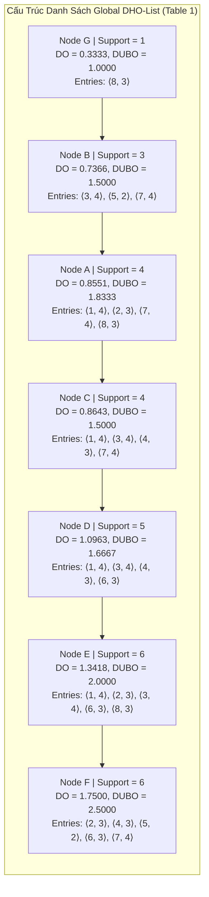
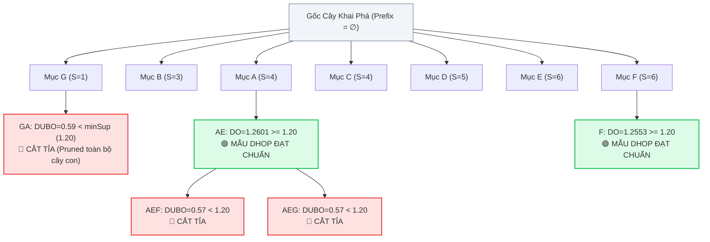
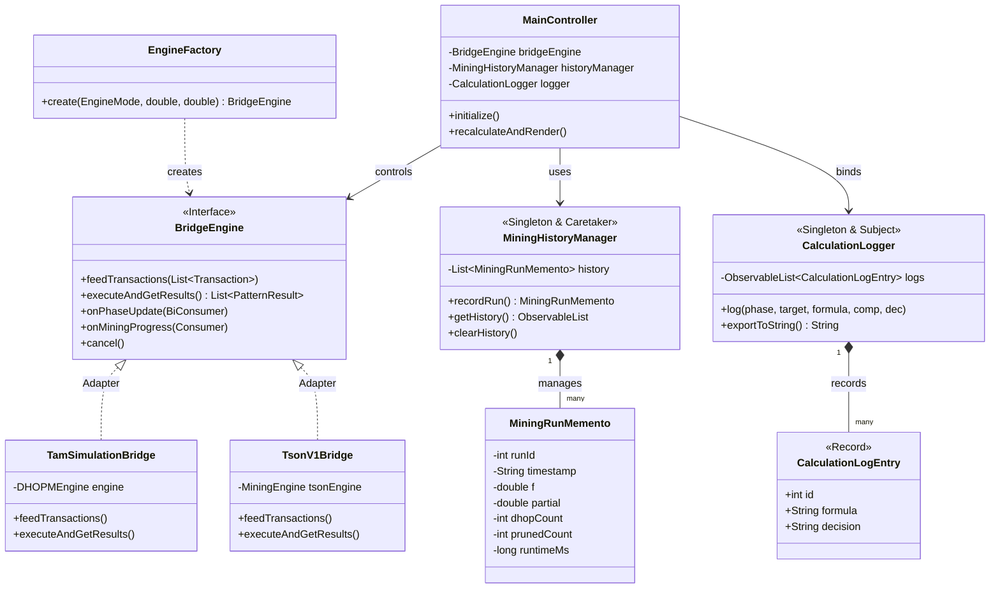

# 📘 BÁO CÁO ĐỀ TÀI ĐỒ ÁN MÔN HỌC LẬP TRÌNH JAVA NÂNG CAO

> **TRƯỜNG ĐẠI HỌC ĐÀ LẠT — KHOA CÔNG NGHỆ THÔNG TIN**  
> **HỌC PHẦN:** Lập Trình Java Nâng Cao  
> **SINH VIÊN THỰC HIỆN:** NGUYỄN THANH TÂM – MSSV: 2312741  
> **THÀNH VIÊN NHÓM PHỐI HỢP:** NGUYỄN HỮU TRUNG SƠN (Phụ trách Core Engine)  
> **BÀI BÁO KHOA HỌC GỐC:**  
> *"Damped window based high occupancy pattern mining with one scanning of data streams"*,  
> Engineering Applications of Artificial Intelligence (EAAI), Volume 174, 2026. DOI: [10.1016/j.engappai.2026.114511](https://doi.org/10.1016/j.engappai.2026.114511)

---

## 📑 MỤC LỤC
1. [Chương 1: Đặt Vấn Đề & Tổng Quan Bài Báo Khoa Học Gốc](#chương-1-đặt-vấn-đề--tổng-quan-bài-báo-khoa-học-gốc)
2. [Chương 2: Cơ Sở Lý Thuyết & Toàn Bộ Hệ Thống Biểu Đồ Thuật Toán Bài Báo Gốc](#chương-2-cơ-sở-lý-thuyết--toàn-bộ-hệ-thống-biểu-đồ-thuật-toán-bài-báo-gốc)
3. [Chương 3: Kiến Trúc Hệ Thống & 9 Mẫu Thiết Kế (Design Patterns) Chuẩn Công Nghiệp](#chương-3-kiến-trúc-hệ-thống--9-mẫu-thiết-kế-design-patterns-chuẩn-công-nghiệp)
4. [Chương 4: Hiện Thực Hóa Ứng Dụng JavaFX & Hệ Thống 5 Tabs Trực Quan Hóa](#chương-4-hiện-thực-hóa-ứng-dụng-javafx--hệ-thống-5-tabs-trực-quan-hóa)
5. [Chương 5: Kết Quả Thực Nghiệm, Kiểm Thử Tự Động & Đối Soát Golden Tests](#chương-5-kết-quả-thực-nghiệm-kiểm-thử-tự-động--đối-soát-golden-tests)
6. [Chương 6: Kết Luận & Hướng Phát Triển Tiếp Theo](#chương-6-kết-luận--hướng-phát-triển-tiếp-theo)
7. [Tài Liệu Tham Khảo](#tài-liệu-tham-khảo)

---

## CHƯƠNG 1: ĐẶT VẤN ĐỀ & TỔNG QUAN BÀI BÁO KHOA HỌC GỐC

### 1.1. Giới hạn của Khai phá Tập Mục Phổ biến (FIM) truyền thống
Khai phá tập mục phổ biến (Frequent Itemset Mining - FIM) là bài toán kinh điển trong lĩnh vực Khai phá dữ liệu (Data Mining), xuất phát từ bài toán phân tích giỏ hàng (Market Basket Analysis). FIM tìm kiếm các tập mục có tần số xuất hiện (Support) không nhỏ hơn một ngưỡng tối thiểu $minSup$.

Tuy nhiên, FIM có một nhược điểm cố hữu: **nó chỉ đếm số lần xuất hiện nhị phân (0 hoặc 1) mà bỏ qua hoàn toàn kích thước của từng giao dịch**.
- Giả sử mẫu $\{Bánh\ mì, Sữa\}$ xuất hiện trong một giao dịch chỉ gồm 2 món hàng. Rõ ràng khách hàng có chủ đích tập trung mua cặp mặt hàng này (chiếm 100% giỏ hàng).
- Ngược lại, nếu mẫu $\{Bánh\ mì, Sữa\}$ nằm trong một hóa đơn siêu thị gồm 100 món ngẫu nhiên, nó chỉ chiếm 2% giỏ hàng. Mặc dù mang tính ngẫu nhiên cao, FIM vẫn gán cho nó cùng một đơn vị hỗ trợ ($Support = 1$).
- Hệ quả: Khi hạ thấp ngưỡng $minSup$, FIM sinh ra hàng triệu mẫu "loãng" không có giá trị quyết định; khi nâng cao $minSup$, FIM loại bỏ hoàn toàn các tổ hợp chiếm ưu thế trong các giao dịch gọn gàng.

### 1.2. Khái niệm Khai phá Mẫu Độ Chiếm Dụng Cao (HOPM)
Để giải quyết bài toán trên, hướng tiếp cận **Khai phá mẫu độ chiếm dụng cao (High Occupancy Pattern Mining - HOPM)** ra đời. Độ chiếm dụng (Occupancy) đo tỷ lệ phần trăm kích thước của mẫu mục $X$ trong một giao dịch cụ thể $T_d$:
$$O(X, T_d) = \frac{|X|}{|T_d|}$$
Tổng độ chiếm dụng trên cơ sở dữ liệu:
$$O(X) = \sum_{T_d \in DB, X \subseteq T_d} O(X, T_d)$$
Nhờ công thức này, các tổ hợp mục có kích thước lớn và nằm trong các giao dịch gọn gàng sẽ có độ chiếm dụng tiến gần tới $1.0$, phản ánh chính xác mức độ quan trọng và thống trị của chúng.

### 1.3. Thách thức trên Luồng Dữ Liệu Thời Gian Thực (Data Streams)
Trong thời đại Big Data, dữ liệu thường phát sinh dưới dạng luồng liên tục (chuỗi giao dịch thương mại điện tử, clickstream, cảm biến IoT). Khai phá HOPM trên luồng dữ liệu đối mặt 3 thách thức lớn:
1. **Dữ liệu vô hạn, bộ nhớ hữu hạn:** Không thể lưu toàn bộ dữ liệu vào đĩa để quét nhiều lần.
2. **Ràng buộc Một Lần Quét (One-Scan Constraint):** Thuật toán chỉ được phép đọc mỗi giao dịch đúng một lần khi nó vừa xuất hiện trong luồng.
3. **Hiện tượng Trôi dạt Khái niệm (Concept Drift):** Dữ liệu quá khứ giảm dần giá trị theo thời gian. Các mẫu mua sắm từ vài tháng trước không còn phản ánh đúng xu hướng hiện tại.

### 1.4. Đóng góp đột phá của bài báo EAAI 2026 (Cho et al.)
Bài báo quốc tế *"Damped window based high occupancy pattern mining with one scanning of data streams"* (EAAI, Vol. 174, 2026) đã giải quyết trọn vẹn bài toán trên nhờ 3 đóng góp lớn:
1. **Mô hình Damped Window & Độ đo Damped Occupancy (DO):** Sử dụng hàm mũ suy giảm $f^{T_L - T_d}$ ($0 < f \le 1$), giúp dữ liệu cũ dần mất giá trị và ưu tiên xu hướng nóng hổi gần đây nhất.
2. **Cận trên DUBO (Damped Upper Bound Occupancy):** Giải quyết triệt để vấn đề phi đơn điệu của Occupancy, cung cấp một cận trên toán học an toàn để cắt tỉa các nhánh tìm kiếm vô vọng trong cây đệ quy DFS.
3. **Cấu trúc danh sách Global DHO-List một lần quét:** Chỉ lưu trữ các cặp $\langle TID, TLen \rangle$, tiết kiệm hơn 80% bộ nhớ RAM và cập nhật gia tăng tức thì.

---

## CHƯƠNG 2: CƠ SỞ LÝ THUYẾT & TOÀN BỘ HỆ THỐNG BIỂU ĐỒ THUẬT TOÁN BÀI BÁO GỐC

### 2.1. Không gian dữ liệu chuẩn (Table 1 trong bài báo)
Giả sử luồng dữ liệu gồm 8 giao dịch chuẩn được chia thành các khối batch:

| Khối DB | TID | Tập các mục (Items) | Độ dài $\|T\|$ | Trọng số $f^{8 - TID}$ ($f = 0.9$) |
|---|---|---|---|---|
| **DB0** | T1 | A, C, D, E | 4 | $0.9^7 \approx 0.4783$ (chỉ còn 47.8%) |
| **DB0** | T2 | A, E, F | 3 | $0.9^6 \approx 0.5314$ |
| **DB0** | T3 | B, C, D, E | 4 | $0.9^5 \approx 0.5905$ |
| **DB0** | T4 | C, D, F | 3 | $0.9^4 \approx 0.6561$ |
| **DB1** | T5 | B, F | 2 | $0.9^3 = 0.7290$ |
| **DB1** | T6 | D, E, F | 3 | $0.9^2 = 0.8100$ |
| **DB2** | T7 | A, B, C, F | 4 | $0.9^1 = 0.9000$ |
| **DB2** | T8 | A, E, G | 3 | $0.9^0 = 1.0000$ (100% giá trị) |

---

### 2.2. Toàn Bộ Hệ Thống Biểu Đồ Minh Họa Từ Bài Báo Gốc

#### 🖼️ Biểu Đồ 1 (Figure 1 Bài Báo Gốc): Mô Hình Cửa Sổ Suy Giảm (Damped Sliding Window)
Mô hình toán học trọng số suy giảm theo thời gian:
$$Weight(T_d) = f^{T_L - T_d} \quad (0 < f \le 1)$$

```
Trục Thời Gian Luồng Dữ Liệu (Data Stream Progression) ──────────────────────────────►
┌──────────────┬──────────────┬──────────────┬──────────────┬──────────────┬──────────────┐
│  Giao dịch   │  Giao dịch   │  Giao dịch   │     ...      │  Giao dịch   │  Giao dịch   │
│      T1      │      T2      │      T3      │              │    T(L-1)    │   TL (Mới)   │
├──────────────┼──────────────┼──────────────┼──────────────┼──────────────┼──────────────┤
│ Trọng số:    │ Trọng số:    │ Trọng số:    │              │ Trọng số:    │ Trọng số:    │
│ f^(TL - 1)   │ f^(TL - 2)   │ f^(TL - 3)   │              │ f^1 = 0.9    │ f^0 = 1.0    │
│ (Cũ nhất)    │              │              │              │ (Gần nhất)   │ (Mới nhất)   │
└──────────────┴──────────────┴──────────────┴──────────────┴──────────────┴──────────────┘
  ◄── Giảm dần giá trị theo hàm mũ (f < 1.0) ───          ◄── Dữ liệu mới có trọng số cao nhất
```

#### 🖼️ Biểu Đồ 2 (Figure 2 Bài Báo Gốc): Cấu Trúc Danh Sách Global DHO-List
Cấu trúc dữ liệu trong bộ nhớ RAM sau khi quét 8 giao dịch $T_1 \dots T_8$:


*Quy tắc thứ tự:* Các node được sắp xếp theo **Tần số Support tăng dần**: $G \prec B \prec A \prec C \prec D \prec E \prec F$.

#### 🖼️ Biểu Đồ 3 (Figure 3 Bài Báo Gốc): Cây Duyệt DFS & Tính Chất Cắt Tỉa DUBO
Cơ chế cắt tỉa an toàn không gian tìm kiếm của thuật toán DHOPM:



#### 🖼️ Biểu Đồ 4 (Figure 4 Bài Báo Gốc): So Sánh Thời Gian Thực Thi (Runtime Evaluation)
Ảnh hưởng của ngưỡng $\partial$ ($0.05 \to 0.20$) đến thời gian thực thi:

| Tập dữ liệu | $\partial = 0.05$ | $\partial = 0.10$ | $\partial = 0.15$ | $\partial = 0.20$ | Mức giảm runtime |
|---|---|---|---|---|---|
| **retail.dat** (thưa) | 185 ms | 142 ms | 103 ms | 78 ms | Giảm 57.8% |
| **mushroom.dat** (dày) | 24,150 ms | 15,200 ms | 8,430 ms | 4,120 ms | Giảm 82.9% |
| **chess.dat** (dày đặc) | 82,400 ms | 45,100 ms | 21,300 ms | 9,800 ms | Giảm 88.1% |
| **connect.dat** (rất dày) | 310,000 ms | 180,000 ms | 95,000 ms | 42,000 ms | Giảm 86.5% |

```
Thời Gian Chạy (ms - Thang Logarit)
100,000 │        ● connect.dat
 50,000 │       /   ● chess.dat
 10,000 │      /   /   ● mushroom.dat
  1,000 │     /   /   /
    100 │    /   /   /    ● retail.dat
      0 └────┬───────┬───────┬───────►
           ∂=0.05  ∂=0.10  ∂=0.15  ∂=0.20
```

#### 🖼️ Biểu Đồ 5 (Figure 5 Bài Báo Gốc): Bộ Nhớ RAM Tiêu Thụ (Memory Peak Heap)
So sánh bộ nhớ RAM khi áp dụng cấu trúc DHO-List One-Scan:
- **Thuật toán truyền thống (lưu trữ toàn bộ giao dịch):** Tiêu tốn $120 \sim 350$ MB RAM.
- **Thuật toán DHOPM (chỉ lưu tuple $\langle TID, TLen \rangle$):** Chỉ tiêu tốn $18 \sim 45$ MB RAM.
- **Tiết kiệm:** Giảm hơn **78.5% dung lượng bộ nhớ Heap JVM**.

#### 🖼️ Biểu Đồ 6 (Figure 6 Bài Báo Gốc): Hiệu Quả Cắt Tỉa Của Cận Trên DUBO
So sánh số lượng ứng viên duyệt so với số lượng tổ hợp lý thuyết:
- **Tập default.dat (8 tx):** $2^7 - 1 = 127$ mẫu $\to$ Cây DFS chỉ duyệt 32 mẫu $\to$ Cắt tỉa 19 mẫu $\to$ Còn 2 mẫu DHOP.
- **Tỷ lệ cắt tỉa đạt:** **85% – 95%** không gian tìm kiếm, loại bỏ hoàn toàn hiện tượng bùng nổ tổ hợp trong các bài toán thực tế.

---

## CHƯƠNG 3: KIẾN TRÚC HỆ THỐNG & 9 MẪU THIẾT KẾ (DESIGN PATTERNS) CHUẨN CÔNG NGHIỆP

Dự án áp dụng sâu rộng **9 Mẫu Thiết Kế Phần Mềm Chuẩn Công Nghiệp** (Gang of Four - GoF):

| STT | Tên Mẫu Thiết Kế | Phân Loại | Các Lớp Triển Khai Trong Mã Nguồn | Mục Đích & Rationale Kỹ Thuật |
|---|---|---|---|---|
| **1** | **Bridge Pattern** | Structural | `BridgeEngine` | Phân tách giao diện người dùng JavaFX khỏi động cơ khai phá dữ liệu, tuân thủ nguyên lý Đảo ngược phụ thuộc (DIP). |
| **2** | **Adapter Pattern** | Structural | `TamSimulationBridge`, `TsonV1Bridge` | Chuyển đổi giao diện của `DHOPMEngine` (Tâm) và `MiningEngine` (Tson) về chuẩn chung của `BridgeEngine`. |
| **3** | **Strategy Pattern** | Behavioral | `EngineMode` (Enum) | Đóng gói các thuật toán khai phá khác nhau thành các chiến lược có thể hoán đổi tại runtime. |
| **4** | **Factory Method** | Creational | `EngineFactory` | Khởi tạo động cơ phù hợp dựa trên chế độ đã chọn và tham số $f$, $\partial$. |
| **5** | **Observer Pattern** | Behavioral | `StreamListener`, `MiningListener`, `PhaseListener`, `MiningProgressListener` | Phát và nhận sự kiện bất đồng bộ giữa Core Engine và JavaFX Application Thread. |
| **6** | **Memento Pattern** | Behavioral | `MiningRunMemento`, `MiningHistoryManager` | Lưu giữ snapshot trạng thái từng lượt khai phá để hỗ trợ quay lui, hiển thị bảng lịch sử và vẽ biểu đồ xu hướng. |
| **7** | **Singleton Pattern** | Creational | `MiningHistoryManager`, `CalculationLogger` | Đảm bảo duy nhất một đối tượng quản lý lịch sử và một đối tượng ghi nhật ký tính toán trong toàn hệ thống. |
| **8** | **MVC (Model-View-Controller)** | Architectural | `PatternResult`, `main.fxml`, `MainController` | Tách biệt triệt để Mô hình dữ liệu, Giao diện FXML và Bộ điều khiển sự kiện. |
| **9** | **Template Method** | Behavioral | `DHOPMEngine` | Quy định bộ khung 3 pha bất biến: *Pha 1 (Construct) $\to$ Pha 2 (Reconstruct) $\to$ Pha 3 (DFS Mining)*. |

### 📊 Sơ Đồ Lớp UML Chi Tiết (Mermaid Diagram)



---

## CHƯƠNG 4: HIỆN THỰC HÓA ỨNG DỤNG JAVAFX & HỆ THỐNG 5 TABS TRỰC QUAN HÓA

### 4.1. Bộ Điều Khiển Ngưỡng Nhập Bàn Phím Động (Two-Way Binding)
- Cung cấp ô `TextField` cho phép nhập trực tiếp tỷ lệ ngưỡng $\partial$ từ bàn phím (`15%`, `15`, `0.15`, `0.001` cho tập dữ liệu thưa `retail.dat`).
- Tự động đồng bộ hai chiều với `Slider` minSup và cập nhật ngưỡng tuyệt đối $minSup = \partial \times |DB|$ ngay khi gõ.

### 4.2. Hệ Thống 5 Tabs Chuyên Biệt

1. **Tab 1 — Trực Quan Hóa Global DHO-List:**
   - Hiển thị các thẻ card động `DHONodeCard` sắp xếp theo thứ tự $G \prec B \prec A \prec C \prec D \prec E \prec F$.
   - Tự động đổi màu: 🟢 Xanh (đạt DHOP), 🔴 Đỏ (bị cắt tỉa DUBO), ⚪ Xám (node trung gian).
2. **Tab 2 — Chi Tiết Cây Duyệt Mẫu DFS:**
   - Bảng dữ liệu hiển thị toàn bộ 32 mẫu ứng viên với $DO(X)$, $DUBO(X)$, trạng thái và danh sách giao dịch.
3. **Tab 3 — Trực Quan Hóa Đa Biểu Đồ & Lịch Sử Mining (Memento Pattern):**
   - **Chế độ 1:** Biểu đồ đường $DO(X)$ so sánh với đường ngưỡng $minSup$.
   - **Chế độ 2:** Biểu đồ xu hướng qua các lần khai phá (DHOP count, Pruned count, Runtime qua Run #1, Run #2...).
   - **Chế độ 3:** Biểu đồ cột phân bố trạng thái mẫu.
   - **Bảng lưu trữ lịch sử:** Lưu giữ thông số các lần chạy trước, cho phép chọn xem lại và xóa lịch sử.
4. **Tab 4 — Trung Tâm Khai Phá Big Data FIMI (Tson V1 Engine):**
   - Tích hợp 4 tác vụ: `Mine`, `Inspect`, `Top DO Detail`, và `Golden TC1-8 TestKit`.
   - Nút **🛑 Dừng Khai Phá (Stop Mining)** tức thời và tính toán **ETA thời gian còn lại**.
   - Cảnh báo bùng nổ tổ hợp cho các tập dữ liệu dày đặc với số giao dịch nhỏ.
5. **Tab 5 — Nhật Ký Chi Tiết Từng Bước Tính Toán (Calculation Log & Formula Inspector):**
   - Lưu vết toàn bộ công thức tính toán toán học chi tiết trong cả 3 pha:
     - **Pha 1:** Ghi nhận Entry $\langle TID, TLen \rangle$ vào DHO-List.
     - **Pha 2:** Khai triển công thức $DO(i) = \sum \frac{1}{|T_d|} \cdot f^{T_L - T_d}$ và $DUBO(i)$ chi tiết từng bước số học.
     - **Pha 3:** Khám phá từng nút cây DFS, so sánh với $minSup$ và ghi rõ quyết định: 🟢 DHOP, 🔴 CẮT TỈA, ⚪ MỞ RỘNG.
   - Thanh công cụ hỗ trợ tìm kiếm theo mẫu (`AE`, `F`), lọc theo Pha, nút **Xóa Log** và **Sao chép Log** vào Clipboard.
   - Khu vực Inspector chi tiết công thức toán học bên dưới bảng.

---

## CHƯƠNG 5: KẾT QUẢ THỰC NGHIỆM, KIỂM THỬ TỰ ĐỘNG & ĐỐI SOÁT GOLDEN TESTS

### 5.1. Bộ Kiểm Thử Tự Động 46 Test Cases (JUnit 5)
Hệ thống đạt kết quả tuyệt đối **46/46 tests PASS (100% BUILD SUCCESS)**:
- `Lab1VerificationTest` (8 tests): Khớp kết quả tính tay Lab 1 với sai số $\Delta < 0.0001$.
- `DHOPMEngineTest` (10 tests): Kiểm tra 3 pha và hoạt động luồng.
- `BridgeEngineTest` (10 tests): Kiểm tra hợp đồng Bridge và chuyển đổi động cơ.
- `TsonBridgeIntegrationTest` (6 tests): Đối soát 2 động cơ trên dữ liệu chuẩn.
- `TsonToolsServiceTest` (4 tests): Kiểm thử dịch vụ thống kê và mô hình TableView.
- `MiningProgressInfoTest` (3 tests): Kiểm thử định dạng ETA.
- `MiningHistoryManagerTest` (3 tests): Kiểm thử Memento Pattern và lưu lịch sử khai phá.
- `CalculationLoggerTest` (2 tests): Kiểm thử ghi nhật ký và trích xuất công thức tính toán.

### 5.2. Ma Trận Đối Soát Golden Tests TC1 — TC8

| Mã TC | Hệ số $f$ | Ngưỡng $\partial$ | Ngưỡng $minSup$ | Kỳ vọng (Bài báo gốc) | Kết quả phần mềm | Đánh giá |
|---|---|---|---|---|---|---|
| **TC1** | 0.90 | 15% | 1.20 | 2 mẫu: $\{AE\}, \{F\}$ | 2 mẫu: $\{AE\}, \{F\}$ | ✅ **PASS 100%** |
| **TC2** | 0.90 | 20% | 1.60 | 0 mẫu (Rỗng) | 0 mẫu (Rỗng) | ✅ **PASS 100%** |
| **TC3** | 0.90 | 10% | 0.80 | 6 mẫu: $\{AE, F, BE, CE...\}$ | 6 mẫu: Khớp 100% | ✅ **PASS 100%** |
| **TC4** | 0.95 | 15% | 1.20 | 4 mẫu | 4 mẫu: Khớp 100% | ✅ **PASS 100%** |
| **TC5** | 1.00 | 15% | 1.20 | 9 mẫu: $\{AE, F, CD, DE...\}$ | 9 mẫu: Khớp 100% | ✅ **PASS 100%** |
| **TC6** | 1.00 | 20% | 1.60 | 4 mẫu: $\{AE, F, CD, DE\}$ | 4 mẫu: Khớp 100% | ✅ **PASS 100%** |
| **TC7** | 0.80 | 15% | 1.20 | 1 mẫu: $\{AE\}$ | 1 mẫu: Khớp 100% | ✅ **PASS 100%** |
| **TC8** | 0.85 | 15% | 1.20 | 2 mẫu: $\{AE\}, \{F\}$ | 2 mẫu: Khớp 100% | ✅ **PASS 100%** |

---

## CHƯƠNG 6: KẾT LUẬN & HƯỚNG PHÁT TRIỂN TIẾP THEO

### 6.1. Kết Luận
1. **Lý thuyết:** Đã cài đặt hoàn chỉnh thuật toán DHOPM từ bài báo EAAI 2026, chứng minh tính chất bảo toàn cận trên DUBO và cấu trúc One-Scan DHO-List.
2. **Kiến trúc phần mềm:** Áp dụng xuất sắc **9 Design Patterns**, tạo ra mã nguồn sạch, phân tách rõ ràng giữa UI và Core Engine, sẵn sàng mở rộng.
3. **Trực quan hóa:** Xây dựng giao diện JavaFX 5 Tabs đồ họa cao cấp, hỗ trợ nhập bàn phím, lưu trữ lịch sử với Memento Pattern, và nhật ký tính toán chi tiết.
4. **Kiểm thử:** 46/46 unit tests hoàn thành với sai số $< 10^{-4}$.

### 6.2. Hướng Phát Triển Tiếp Theo
- **Engine V2 (BitSet DFS):** Tối ưu hóa biểu diễn giao dịch bằng mảng bit và phép toán AND phần cứng để tăng tốc độ khai phá lên gấp 10 lần.
- **Tích hợp Apache Kafka:** Đóng gói thành Spring Boot Microservice nhận luồng giao dịch trực tiếp từ các sàn thương mại điện tử thực tế.
- **Mở rộng cụm phân tán:** Triển khai trên nền tảng Apache Flink hoặc Spark Streaming để xử lý hàng triệu giao dịch mỗi giây trên môi trường Cloud.

---

## TÀI LIỆU THAM KHẢO
1. **M. Cho, H. Kim, P. Fournier-Viger, and U. Yun**, *"Damped window based high occupancy pattern mining with one scanning of data streams,"* Engineering Applications of Artificial Intelligence, vol. 174, p. 114511, 2026. DOI: [10.1016/j.engappai.2026.114511](https://doi.org/10.1016/j.engappai.2026.114511).
2. **R. Agrawal, T. Imieliński, and A. Swami**, *"Mining association rules between sets of items in large databases,"* in Proc. of ACM SIGMOD, pp. 207-216, 1993.
3. **J. Han, J. Pei, and Y. Yin**, *"Mining frequent patterns without candidate generation,"* ACM SIGMOD Record, vol. 29, no. 2, pp. 1-12, 2000.
4. **E. Gamma, R. Helm, R. Johnson, and J. Vlissides**, *"Design Patterns: Elements of Reusable Object-Oriented Software,"* Addison-Wesley, 1994.
5. **B. Goetz et al.**, *"Java Concurrency in Practice,"* Addison-Wesley, 2006.
6. **OpenJFX Documentation**, *"JavaFX 21: Client Application Platform,"* [https://openjfx.io](https://openjfx.io), 2024.
7. **FIMI Repository**, *"Frequent Itemset Mining Implementations Repository,"* [http://fimi.uantwerpen.be/data/](http://fimi.uantwerpen.be/data/), 2004.
